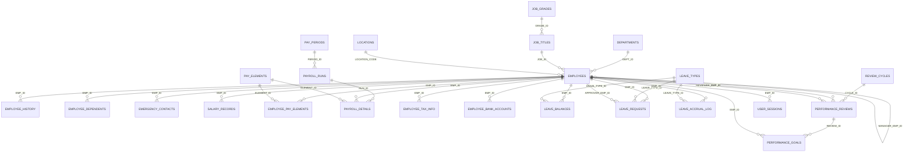

# HRMS Data Dictionary

Business-entity dictionary extracted from the checked-in DDL under `schema/tables/` (30 tables), `schema/views/hrms_views.sql` (6 views) and `schema/sequences/hrms_sequences.sql` (29 sequences). Column lists are generated directly from the DDL; purpose, semantics and drift notes come from reading the PL/SQL, triggers and Forms that use each table.

> Scope note: the README claims 42 tables / 15 views and lists `indexes/` and `constraints/` directories. Those are **not in the repository**; this dictionary covers only what is physically present. All constraints are inline in the `CREATE TABLE` statements and **no secondary indexes exist** in source (only PK/UK-backed indexes).

## Contents

1. [Organization & Job Architecture](#1-organization--job-architecture) - `DEPARTMENTS`, `LOCATIONS`, `JOB_GRADES`, `JOB_TITLES`
2. [Employee Core & Personal Data](#2-employee-core--personal-data) - `EMPLOYEES`, `EMPLOYEE_HISTORY`, `EMPLOYEE_DEPENDENTS`, `EMERGENCY_CONTACTS`
3. [Compensation & Payroll](#3-compensation--payroll) - `SALARY_RECORDS`, `PAY_ELEMENTS`, `EMPLOYEE_PAY_ELEMENTS`, `PAY_PERIODS`, `PAYROLL_RUNS`, `PAYROLL_DETAILS`, `TAX_BRACKETS`, `EMPLOYEE_TAX_INFO`, `EMPLOYEE_BANK_ACCOUNTS`
4. [Leave & Absence](#4-leave--absence) - `LEAVE_TYPES`, `LEAVE_BALANCES`, `LEAVE_REQUESTS`, `LEAVE_ACCRUAL_LOG`, `HOLIDAYS`
5. [Performance Management](#5-performance-management) - `REVIEW_CYCLES`, `PERFORMANCE_REVIEWS`, `PERFORMANCE_GOALS`
6. [Platform / Cross-Cutting](#6-platform--cross-cutting) - `AUDIT_LOG`, `SYSTEM_PARAMETERS`, `NOTIFICATION_QUEUE`, `USER_SESSIONS`, `LOOKUP_VALUES`
7. [Views](#7-views)
8. [Sequences](#8-sequences)
9. [Sensitive data register](#9-sensitive-data-register)
10. [Status and flag semantics](#10-status-and-flag-semantics)

## Entity-relationship overview

Relationships that exist logically but are **not** enforced by a foreign key: `DEPARTMENTS.PARENT_DEPT_ID`, `DEPARTMENTS.MANAGER_EMP_ID`, `DEPARTMENTS.LOCATION_CODE`, `HOLIDAYS.LOCATION_CODE`, `SALARY_RECORDS.APPROVED_BY`, `LEAVE_ACCRUAL_LOG.RUN_ID`, `LOOKUP_VALUES` parent, `AUDIT_LOG.RECORD_ID` (polymorphic), `NOTIFICATION_QUEUE.REFERENCE_TABLE/REFERENCE_ID` (polymorphic). `PKG_SECURITY` also references a `USER_CREDENTIALS` concept in comments that has no table.

## 1. Organization & Job Architecture

Reference structure that every employee record hangs off: org units, physical sites, pay grades and job catalog.

| Entity | Purpose | PK | Cols | Source |
|---|---|---|---|---|
| `DEPARTMENTS` | Organizational unit (cost center, parent department, head of department, budget). | `DEPT_ID` | 12 | `schema/tables/01_core_tables.sql` L10 |
| `LOCATIONS` | Physical office/site, keyed by a natural `LOCATION_CODE` (e.g. `HQ`, `CHI`); carries time zone. | `LOCATION_CODE` | 15 | `schema/tables/01_core_tables.sql` L35 |
| `JOB_GRADES` | Pay grade band with min/mid/max salary; used for salary-range validation and (mis)used as an authorization level by `PKG_SECURITY.has_permission`. | `GRADE_ID` | 11 | `schema/tables/01_core_tables.sql` L57 |
| `JOB_TITLES` | Job catalog entry mapped to a grade, with FLSA/EEO classification. | `JOB_ID` | 12 | `schema/tables/01_core_tables.sql` L77 |

### DEPARTMENTS

Organizational unit (cost center, parent department, head of department, budget).

- **Source:** `schema/tables/01_core_tables.sql` (line 10)
- **Primary key:** `DEPT_ID`
- **Other constraints:** `UK_DEPT_CODE UNIQUE (DEPT_CODE)`; `CHK_DEPT_ACTIVE CHECK (ACTIVE_FLAG IN ('Y', 'N'))`
- `PARENT_DEPT_ID`, `MANAGER_EMP_ID`, `LOCATION_CODE` have **no foreign keys** - hierarchy and head-of-department integrity is unenforced.
- Audited by `TRG_DEPARTMENT_AUDIT`. No maintenance form is checked in (`HRMS_DEPARTMENT.xml` missing).

| Column | Type | Null? | Default | Notes |
|---|---|---|---|---|
| `DEPT_ID` | NUMBER(10) | N |  |  |
| `DEPT_CODE` | VARCHAR2(20) | N |  |  |
| `DEPT_NAME` | VARCHAR2(100) | N |  |  |
| `PARENT_DEPT_ID` | NUMBER(10) | Y |  |  |
| `COST_CENTER` | VARCHAR2(20) | Y |  |  |
| `MANAGER_EMP_ID` | NUMBER(10) | Y |  |  |
| `LOCATION_CODE` | VARCHAR2(10) | Y |  |  |
| `ACTIVE_FLAG` | CHAR(1) | N | `'Y'` |  |
| `CREATED_BY` | VARCHAR2(30) | N |  |  |
| `CREATED_DATE` | DATE | N | `SYSDATE` |  |
| `MODIFIED_BY` | VARCHAR2(30) | Y |  |  |
| `MODIFIED_DATE` | DATE | Y |  |  |

### LOCATIONS

Physical office/site, keyed by a natural `LOCATION_CODE` (e.g. `HQ`, `CHI`); carries time zone.

- **Source:** `schema/tables/01_core_tables.sql` (line 35)
- **Primary key:** `LOCATION_CODE`

| Column | Type | Null? | Default | Notes |
|---|---|---|---|---|
| `LOCATION_CODE` | VARCHAR2(10) | N |  |  |
| `LOCATION_NAME` | VARCHAR2(100) | N |  |  |
| `ADDRESS_LINE1` | VARCHAR2(200) | Y |  | _PII_ |
| `ADDRESS_LINE2` | VARCHAR2(200) | Y |  |  |
| `CITY` | VARCHAR2(100) | Y |  |  |
| `STATE_PROVINCE` | VARCHAR2(100) | Y |  |  |
| `POSTAL_CODE` | VARCHAR2(20) | Y |  |  |
| `COUNTRY_CODE` | VARCHAR2(3) | Y |  |  |
| `PHONE_NUMBER` | VARCHAR2(30) | Y |  |  |
| `TIMEZONE` | VARCHAR2(50) | Y | `'America/New_York'` |  |
| `ACTIVE_FLAG` | CHAR(1) | N | `'Y'` |  |
| `CREATED_BY` | VARCHAR2(30) | N |  |  |
| `CREATED_DATE` | DATE | N | `SYSDATE` |  |
| `MODIFIED_BY` | VARCHAR2(30) | Y |  |  |
| `MODIFIED_DATE` | DATE | Y |  |  |

### JOB_GRADES

Pay grade band with min/mid/max salary; used for salary-range validation and (mis)used as an authorization level by `PKG_SECURITY.has_permission`.

- **Source:** `schema/tables/01_core_tables.sql` (line 57)
- **Primary key:** `GRADE_ID`
- **Other constraints:** `UK_GRADE_CODE UNIQUE (GRADE_CODE)`; `CHK_SALARY_RANGE CHECK (MAX_SALARY >= MIN_SALARY)`

| Column | Type | Null? | Default | Notes |
|---|---|---|---|---|
| `GRADE_ID` | NUMBER(5) | N |  |  |
| `GRADE_CODE` | VARCHAR2(10) | N |  |  |
| `GRADE_NAME` | VARCHAR2(50) | N |  |  |
| `MIN_SALARY` | NUMBER(12,2) | N |  |  |
| `MAX_SALARY` | NUMBER(12,2) | N |  |  |
| `OVERTIME_ELIGIBLE` | CHAR(1) | Y | `'N'` |  |
| `ACTIVE_FLAG` | CHAR(1) | N | `'Y'` |  |
| `CREATED_BY` | VARCHAR2(30) | N |  |  |
| `CREATED_DATE` | DATE | N | `SYSDATE` |  |
| `MODIFIED_BY` | VARCHAR2(30) | Y |  |  |
| `MODIFIED_DATE` | DATE | Y |  |  |

### JOB_TITLES

Job catalog entry mapped to a grade, with FLSA/EEO classification.

- **Source:** `schema/tables/01_core_tables.sql` (line 77)
- **Primary key:** `JOB_ID`
- **Foreign keys:** `GRADE_ID` -> `JOB_GRADES.GRADE_ID` (FK_JOB_GRADE)
- **Other constraints:** `UK_JOB_CODE UNIQUE (JOB_CODE)`

| Column | Type | Null? | Default | Notes |
|---|---|---|---|---|
| `JOB_ID` | NUMBER(10) | N |  |  |
| `JOB_CODE` | VARCHAR2(20) | N |  |  |
| `JOB_TITLE` | VARCHAR2(100) | N |  |  |
| `JOB_FAMILY` | VARCHAR2(50) | Y |  |  |
| `GRADE_ID` | NUMBER(5) | N |  |  |
| `EEO_CATEGORY` | VARCHAR2(10) | Y |  |  |
| `FLSA_STATUS` | VARCHAR2(10) | Y | `'EXEMPT'` |  |
| `ACTIVE_FLAG` | CHAR(1) | N | `'Y'` |  |
| `CREATED_BY` | VARCHAR2(30) | N |  |  |
| `CREATED_DATE` | DATE | N | `SYSDATE` |  |
| `MODIFIED_BY` | VARCHAR2(30) | Y |  |  |
| `MODIFIED_DATE` | DATE | Y |  |  |

## 2. Employee Core & Personal Data

The person/worker master record and its personal satellites (lifecycle history, dependents, emergency contacts).

| Entity | Purpose | PK | Cols | Source |
|---|---|---|---|---|
| `EMPLOYEES` | Worker master: identity, contact, address, encrypted SSN, assignment (dept/job/manager/location), employment type/status and termination data. | `EMP_ID` | 35 | `schema/tables/01_core_tables.sql` L98 |
| `EMPLOYEE_HISTORY` | Effective-dated lifecycle events (hire, transfer, promotion, termination, rehire...) with before/after department, job, manager, salary and location. | `HIST_ID` | 18 | `schema/tables/01_core_tables.sql` L152 |
| `EMPLOYEE_DEPENDENTS` | Dependents for benefits enrollment (exported in the ADP benefits feed). | `DEPENDENT_ID` | 13 | `schema/tables/01_core_tables.sql` L182 |
| `EMERGENCY_CONTACTS` | Employee emergency contacts. | `CONTACT_ID` | 13 | `schema/tables/01_core_tables.sql` L204 |

### EMPLOYEES

Worker master: identity, contact, address, encrypted SSN, assignment (dept/job/manager/location), employment type/status and termination data.

- **Source:** `schema/tables/01_core_tables.sql` (line 98)
- **Primary key:** `EMP_ID`
- **Foreign keys:** `DEPT_ID` -> `DEPARTMENTS.DEPT_ID` (FK_EMP_DEPT); `JOB_ID` -> `JOB_TITLES.JOB_ID` (FK_EMP_JOB); `MANAGER_EMP_ID` -> `EMPLOYEES.EMP_ID` (FK_EMP_MANAGER); `LOCATION_CODE` -> `LOCATIONS.LOCATION_CODE` (FK_EMP_LOCATION)
- **Other constraints:** `UK_EMP_NUMBER UNIQUE (EMP_NUMBER)`; `CHK_EMP_STATUS CHECK (EMPLOYMENT_STATUS IN ('ACTIVE', 'ON_LEAVE', 'SUSPENDED', 'TERMINATED'))`; `CHK_EMP_TYPE CHECK (EMPLOYMENT_TYPE IN ('FULL_TIME', 'PART_TIME', 'CONTRACT', 'INTERN'))`; `CHK_EMP_GENDER CHECK (GENDER IN ('M', 'F', 'O'))`
- `EMAIL` doubles as the login name (`PKG_SECURITY.authenticate`, `HRMS_LOGIN`) but has **no unique constraint**; uniqueness is attempted only in `TRG_EMP_BEFORE_INSERT` (race-prone).
- `EMP_NUMBER` format `EMP-nnnnnn` generated by `PKG_EMPLOYEE.generate_emp_number` (MAX()+1); `SEQ_EMP_NUMBER` exists but is unused.
- Delete is blocked by `TRG_EMP_INSTEAD_OF_DELETE` (soft-delete via `ACTIVE_FLAG`/status).
- Status semantics: `ACTIVE`, `ON_LEAVE`, `SUSPENDED`, `TERMINATED`. Most queries filter on both `EMPLOYMENT_STATUS='ACTIVE'` and `ACTIVE_FLAG='Y'`, but not consistently.

| Column | Type | Null? | Default | Notes |
|---|---|---|---|---|
| `EMP_ID` | NUMBER(10) | N |  |  |
| `EMP_NUMBER` | VARCHAR2(20) | N |  |  |
| `FIRST_NAME` | VARCHAR2(50) | N |  |  |
| `MIDDLE_NAME` | VARCHAR2(50) | Y |  |  |
| `LAST_NAME` | VARCHAR2(50) | N |  |  |
| `DATE_OF_BIRTH` | DATE | Y |  | _PII_ |
| `GENDER` | CHAR(1) | Y |  | _Sensitive/EEO_ |
| `MARITAL_STATUS` | VARCHAR2(10) | Y |  | _PII_ |
| `NATIONALITY` | VARCHAR2(50) | Y |  |  |
| `SSN_ENCRYPTED` | VARCHAR2(200) | Y |  | _Restricted PII (encrypted)_ |
| `EMAIL` | VARCHAR2(100) | Y |  | _PII / login id_ |
| `PHONE_WORK` | VARCHAR2(30) | Y |  |  |
| `PHONE_MOBILE` | VARCHAR2(30) | Y |  | _PII_ |
| `ADDRESS_LINE1` | VARCHAR2(200) | Y |  | _PII_ |
| `ADDRESS_LINE2` | VARCHAR2(200) | Y |  |  |
| `CITY` | VARCHAR2(100) | Y |  |  |
| `STATE_PROVINCE` | VARCHAR2(100) | Y |  |  |
| `POSTAL_CODE` | VARCHAR2(20) | Y |  |  |
| `COUNTRY_CODE` | VARCHAR2(3) | Y |  |  |
| `HIRE_DATE` | DATE | N |  |  |
| `TERMINATION_DATE` | DATE | Y |  |  |
| `TERMINATION_REASON` | VARCHAR2(50) | Y |  |  |
| `DEPT_ID` | NUMBER(10) | N |  |  |
| `JOB_ID` | NUMBER(10) | N |  |  |
| `MANAGER_EMP_ID` | NUMBER(10) | Y |  |  |
| `LOCATION_CODE` | VARCHAR2(10) | Y |  |  |
| `EMPLOYMENT_TYPE` | VARCHAR2(20) | Y | `'FULL_TIME'` |  |
| `EMPLOYMENT_STATUS` | VARCHAR2(20) | Y | `'ACTIVE'` |  |
| `PHOTO_BLOB` | BLOB | Y |  |  |
| `NOTES` | CLOB | Y |  |  |
| `ACTIVE_FLAG` | CHAR(1) | N | `'Y'` |  |
| `CREATED_BY` | VARCHAR2(30) | N |  |  |
| `CREATED_DATE` | DATE | N | `SYSDATE` |  |
| `MODIFIED_BY` | VARCHAR2(30) | Y |  |  |
| `MODIFIED_DATE` | DATE | Y |  |  |

### EMPLOYEE_HISTORY

Effective-dated lifecycle events (hire, transfer, promotion, termination, rehire...) with before/after department, job, manager, salary and location.

- **Source:** `schema/tables/01_core_tables.sql` (line 152)
- **Primary key:** `HIST_ID`
- **Foreign keys:** `EMP_ID` -> `EMPLOYEES.EMP_ID` (FK_HIST_EMP)
- **Other constraints:** `CHK_CHANGE_TYPE CHECK (CHANGE_TYPE IN ( 'HIRE', 'TRANSFER', 'PROMOTION', 'DEMOTION', 'SALARY_CHANGE' 'TERMINATION', 'REHIRE', 'LEAVE_START', 'LEAVE_END', 'STATU`
- **Drift:** `TRG_EMP_BEFORE_UPDATE` inserts into columns that do not exist here (`HISTORY_ID`, `CHANGE_DATE`, `OLD_VALUE`, `NEW_VALUE`, `CHANGED_BY`, `CHANGE_REASON`) and uses `CHANGE_TYPE` values (`DEPARTMENT_CHANGE`, `JOB_CHANGE`) not allowed by `CHK_CHANGE_TYPE`.

| Column | Type | Null? | Default | Notes |
|---|---|---|---|---|
| `HIST_ID` | NUMBER(15) | N |  |  |
| `EMP_ID` | NUMBER(10) | N |  |  |
| `CHANGE_TYPE` | VARCHAR2(30) | N |  |  |
| `EFFECTIVE_DATE` | DATE | N |  |  |
| `OLD_DEPT_ID` | NUMBER(10) | Y |  |  |
| `NEW_DEPT_ID` | NUMBER(10) | Y |  |  |
| `OLD_JOB_ID` | NUMBER(10) | Y |  |  |
| `NEW_JOB_ID` | NUMBER(10) | Y |  |  |
| `OLD_MANAGER_ID` | NUMBER(10) | Y |  |  |
| `NEW_MANAGER_ID` | NUMBER(10) | Y |  |  |
| `OLD_SALARY` | NUMBER(12,2) | Y |  |  |
| `NEW_SALARY` | NUMBER(12,2) | Y |  |  |
| `OLD_LOCATION` | VARCHAR2(10) | Y |  |  |
| `NEW_LOCATION` | VARCHAR2(10) | Y |  |  |
| `REASON_CODE` | VARCHAR2(30) | Y |  |  |
| `COMMENTS` | VARCHAR2(4000) | Y |  |  |
| `CREATED_BY` | VARCHAR2(30) | N |  |  |
| `CREATED_DATE` | DATE | N | `SYSDATE` |  |

### EMPLOYEE_DEPENDENTS

Dependents for benefits enrollment (exported in the ADP benefits feed).

- **Source:** `schema/tables/01_core_tables.sql` (line 182)
- **Primary key:** `DEPENDENT_ID`
- **Foreign keys:** `EMP_ID` -> `EMPLOYEES.EMP_ID` (FK_DEP_EMP)
- **Other constraints:** `CHK_RELATIONSHIP CHECK (RELATIONSHIP IN ('SPOUSE', 'CHILD', 'PARENT', 'DOMESTIC_PARTNER', 'OTHER'))`

| Column | Type | Null? | Default | Notes |
|---|---|---|---|---|
| `DEPENDENT_ID` | NUMBER(10) | N |  |  |
| `EMP_ID` | NUMBER(10) | N |  |  |
| `FIRST_NAME` | VARCHAR2(50) | N |  |  |
| `LAST_NAME` | VARCHAR2(50) | N |  |  |
| `RELATIONSHIP` | VARCHAR2(20) | N |  |  |
| `DATE_OF_BIRTH` | DATE | Y |  | _PII_ |
| `SSN_ENCRYPTED` | VARCHAR2(200) | Y |  | _Restricted PII (encrypted)_ |
| `BENEFITS_ENROLLED` | CHAR(1) | Y | `'N'` |  |
| `ACTIVE_FLAG` | CHAR(1) | N | `'Y'` |  |
| `CREATED_BY` | VARCHAR2(30) | N |  |  |
| `CREATED_DATE` | DATE | N | `SYSDATE` |  |
| `MODIFIED_BY` | VARCHAR2(30) | Y |  |  |
| `MODIFIED_DATE` | DATE | Y |  |  |

### EMERGENCY_CONTACTS

Employee emergency contacts.

- **Source:** `schema/tables/01_core_tables.sql` (line 204)
- **Primary key:** `CONTACT_ID`
- **Foreign keys:** `EMP_ID` -> `EMPLOYEES.EMP_ID` (FK_EC_EMP)

| Column | Type | Null? | Default | Notes |
|---|---|---|---|---|
| `CONTACT_ID` | NUMBER(10) | N |  |  |
| `EMP_ID` | NUMBER(10) | N |  |  |
| `CONTACT_NAME` | VARCHAR2(100) | N |  |  |
| `RELATIONSHIP` | VARCHAR2(30) | Y |  |  |
| `PHONE_PRIMARY` | VARCHAR2(30) | N |  |  |
| `PHONE_SECONDARY` | VARCHAR2(30) | Y |  |  |
| `EMAIL` | VARCHAR2(100) | Y |  | _PII / login id_ |
| `PRIORITY_ORDER` | NUMBER(2) | Y | `1` |  |
| `ACTIVE_FLAG` | CHAR(1) | N | `'Y'` |  |
| `CREATED_BY` | VARCHAR2(30) | N |  |  |
| `CREATED_DATE` | DATE | N | `SYSDATE` |  |
| `MODIFIED_BY` | VARCHAR2(30) | Y |  |  |
| `MODIFIED_DATE` | DATE | Y |  |  |

## 3. Compensation & Payroll

Salary history, earning/deduction catalog, pay calendar, payroll runs and line-level results, tax setup and direct-deposit banking.

| Entity | Purpose | PK | Cols | Source |
|---|---|---|---|---|
| `SALARY_RECORDS` | Effective-dated base salary history; `ACTIVE_FLAG='Y'` marks the current record. | `SALARY_ID` | 17 | `schema/tables/02_payroll_tables.sql` L10 |
| `PAY_ELEMENTS` | Catalog of earnings, deductions, taxes, benefits and reimbursements with GL account mapping. Seeded IDs 1, 100-103 and 200-205 are hard-coded in `PKG_PAYROLL`/`PKG_REPORTING`. | `ELEMENT_ID` | 17 | `schema/tables/02_payroll_tables.sql` L37 |
| `EMPLOYEE_PAY_ELEMENTS` | Recurring per-employee element assignments (e.g. 401k %, medical premium). | `EMP_ELEMENT_ID` | 13 | `schema/tables/02_payroll_tables.sql` L64 |
| `PAY_PERIODS` | Pay calendar (start/end/pay date, frequency, status). | `PERIOD_ID` | 13 | `schema/tables/02_payroll_tables.sql` L86 |
| `PAYROLL_RUNS` | One execution of payroll for a period, with run type, lifecycle status and denormalized totals. | `RUN_ID` | 19 | `schema/tables/02_payroll_tables.sql` L107 |
| `PAYROLL_DETAILS` | Line-level payroll result: one row per run x employee x element. | `DETAIL_ID` | 13 | `schema/tables/02_payroll_tables.sql` L136 |
| `TAX_BRACKETS` | Tax bracket reference by year/jurisdiction/filing status. **Defined but never read** - `PKG_PAYROLL` hard-codes 2024 brackets. | `BRACKET_ID` | 11 | `schema/tables/02_payroll_tables.sql` L159 |
| `EMPLOYEE_TAX_INFO` | Per-employee, per-year W-4 style data (filing status, allowances, extra withholding, state). | `TAX_INFO_ID` | 16 | `schema/tables/02_payroll_tables.sql` L178 |
| `EMPLOYEE_BANK_ACCOUNTS` | Direct-deposit accounts and split rules. | `BANK_ACCT_ID` | 17 | `schema/tables/02_payroll_tables.sql` L203 |

### SALARY_RECORDS

Effective-dated base salary history; `ACTIVE_FLAG='Y'` marks the current record.

- **Source:** `schema/tables/02_payroll_tables.sql` (line 10)
- **Primary key:** `SALARY_ID`
- **Foreign keys:** `EMP_ID` -> `EMPLOYEES.EMP_ID` (FK_SAL_EMP)
- **Other constraints:** `CHK_PAY_FREQ CHECK (PAY_FREQUENCY IN ('WEEKLY', 'BIWEEKLY', 'SEMIMONTHLY', 'MONTHLY'))`; `CHK_SAL_BASIS CHECK (SALARY_BASIS IN ('ANNUAL', 'HOURLY'))`
- No constraint prevents two `ACTIVE_FLAG='Y'` rows per employee; future-dated records created by `PKG_PAYROLL.create_salary_record` can produce overlaps, which duplicate rows in `VW_ACTIVE_EMPLOYEES`/`VW_EMPLOYEE_COMPENSATION`.
- `APPROVED_BY` has no FK. `PAY_FREQUENCY` is stored but ignored by payroll calculation.

| Column | Type | Null? | Default | Notes |
|---|---|---|---|---|
| `SALARY_ID` | NUMBER(10) | N |  |  |
| `EMP_ID` | NUMBER(10) | N |  |  |
| `EFFECTIVE_DATE` | DATE | N |  |  |
| `END_DATE` | DATE | Y |  |  |
| `BASE_SALARY` | NUMBER(12,2) | N |  | _Confidential comp_ |
| `CURRENCY_CODE` | VARCHAR2(3) | Y | `'USD'` |  |
| `PAY_FREQUENCY` | VARCHAR2(20) | Y | `'MONTHLY'` |  |
| `SALARY_BASIS` | VARCHAR2(20) | Y | `'ANNUAL'` |  |
| `CHANGE_REASON` | VARCHAR2(50) | Y |  |  |
| `CHANGE_PCT` | NUMBER(5,2) | Y |  |  |
| `APPROVED_BY` | NUMBER(10) | Y |  |  |
| `APPROVAL_DATE` | DATE | Y |  |  |
| `ACTIVE_FLAG` | CHAR(1) | N | `'Y'` |  |
| `CREATED_BY` | VARCHAR2(30) | N |  |  |
| `CREATED_DATE` | DATE | N | `SYSDATE` |  |
| `MODIFIED_BY` | VARCHAR2(30) | Y |  |  |
| `MODIFIED_DATE` | DATE | Y |  |  |

### PAY_ELEMENTS

Catalog of earnings, deductions, taxes, benefits and reimbursements with GL account mapping. Seeded IDs 1, 100-103 and 200-205 are hard-coded in `PKG_PAYROLL`/`PKG_REPORTING`.

- **Source:** `schema/tables/02_payroll_tables.sql` (line 37)
- **Primary key:** `ELEMENT_ID`
- **Other constraints:** `UK_PAY_ELEM_CODE UNIQUE (ELEMENT_CODE)`; `CHK_ELEM_TYPE CHECK (ELEMENT_TYPE IN ('EARNING', 'DEDUCTION', 'TAX', 'BENEFIT', 'REIMBURSEMENT'))`; `CHK_CALC_TYPE CHECK (CALCULATION_TYPE IN ('FLAT', 'PERCENTAGE', 'HOURS', 'FORMULA'))`

| Column | Type | Null? | Default | Notes |
|---|---|---|---|---|
| `ELEMENT_ID` | NUMBER(10) | N |  |  |
| `ELEMENT_CODE` | VARCHAR2(30) | N |  |  |
| `ELEMENT_NAME` | VARCHAR2(100) | N |  |  |
| `ELEMENT_TYPE` | VARCHAR2(20) | N |  |  |
| `CALCULATION_TYPE` | VARCHAR2(20) | N |  |  |
| `DEFAULT_AMOUNT` | NUMBER(12,2) | Y |  |  |
| `DEFAULT_PERCENTAGE` | NUMBER(5,2) | Y |  |  |
| `TAXABLE_FLAG` | CHAR(1) | Y | `'Y'` |  |
| `PRETAX_FLAG` | CHAR(1) | Y | `'N'` |  |
| `EMPLOYER_PAID` | CHAR(1) | Y | `'N'` |  |
| `GL_ACCOUNT_CODE` | VARCHAR2(30) | Y |  |  |
| `PRIORITY_ORDER` | NUMBER(5) | Y | `100` |  |
| `ACTIVE_FLAG` | CHAR(1) | N | `'Y'` |  |
| `CREATED_BY` | VARCHAR2(30) | N |  |  |
| `CREATED_DATE` | DATE | N | `SYSDATE` |  |
| `MODIFIED_BY` | VARCHAR2(30) | Y |  |  |
| `MODIFIED_DATE` | DATE | Y |  |  |

### EMPLOYEE_PAY_ELEMENTS

Recurring per-employee element assignments (e.g. 401k %, medical premium).

- **Source:** `schema/tables/02_payroll_tables.sql` (line 64)
- **Primary key:** `EMP_ELEMENT_ID`
- **Foreign keys:** `EMP_ID` -> `EMPLOYEES.EMP_ID` (FK_EPE_EMP); `ELEMENT_ID` -> `PAY_ELEMENTS.ELEMENT_ID` (FK_EPE_ELEMENT)

| Column | Type | Null? | Default | Notes |
|---|---|---|---|---|
| `EMP_ELEMENT_ID` | NUMBER(10) | N |  |  |
| `EMP_ID` | NUMBER(10) | N |  |  |
| `ELEMENT_ID` | NUMBER(10) | N |  |  |
| `EFFECTIVE_DATE` | DATE | N |  |  |
| `END_DATE` | DATE | Y |  |  |
| `AMOUNT` | NUMBER(12,2) | Y |  | _Confidential comp_ |
| `PERCENTAGE` | NUMBER(5,2) | Y |  |  |
| `OVERRIDE_AMOUNT` | NUMBER(12,2) | Y |  |  |
| `ACTIVE_FLAG` | CHAR(1) | N | `'Y'` |  |
| `CREATED_BY` | VARCHAR2(30) | N |  |  |
| `CREATED_DATE` | DATE | N | `SYSDATE` |  |
| `MODIFIED_BY` | VARCHAR2(30) | Y |  |  |
| `MODIFIED_DATE` | DATE | Y |  |  |

### PAY_PERIODS

Pay calendar (start/end/pay date, frequency, status).

- **Source:** `schema/tables/02_payroll_tables.sql` (line 86)
- **Primary key:** `PERIOD_ID`
- **Other constraints:** `CHK_PERIOD_STATUS CHECK (STATUS IN ('OPEN', 'PROCESSING', 'CLOSED', 'REVERSED'))`

| Column | Type | Null? | Default | Notes |
|---|---|---|---|---|
| `PERIOD_ID` | NUMBER(10) | N |  |  |
| `PERIOD_NAME` | VARCHAR2(50) | N |  |  |
| `PAY_FREQUENCY` | VARCHAR2(20) | N |  |  |
| `PERIOD_START_DATE` | DATE | N |  |  |
| `PERIOD_END_DATE` | DATE | N |  |  |
| `PAY_DATE` | DATE | N |  |  |
| `STATUS` | VARCHAR2(20) | Y | `'OPEN'` |  |
| `CLOSED_BY` | VARCHAR2(30) | Y |  |  |
| `CLOSED_DATE` | DATE | Y |  |  |
| `CREATED_BY` | VARCHAR2(30) | N |  |  |
| `CREATED_DATE` | DATE | N | `SYSDATE` |  |
| `MODIFIED_BY` | VARCHAR2(30) | Y |  |  |
| `MODIFIED_DATE` | DATE | Y |  |  |

### PAYROLL_RUNS

One execution of payroll for a period, with run type, lifecycle status and denormalized totals.

- **Source:** `schema/tables/02_payroll_tables.sql` (line 107)
- **Primary key:** `RUN_ID`
- **Foreign keys:** `PERIOD_ID` -> `PAY_PERIODS.PERIOD_ID` (FK_PR_PERIOD)
- **Other constraints:** `CHK_RUN_TYPE CHECK (RUN_TYPE IN ('REGULAR', 'SUPPLEMENTAL', 'BONUS', 'FINAL'))`; `CHK_RUN_STATUS CHECK (STATUS IN ('PENDING', 'CALCULATING', 'CALCULATED', 'APPROVED', 'PAID', 'REVERSED', 'ERROR'))`
- Status machine: `PENDING -> CALCULATING -> CALCULATED -> APPROVED -> PAID`, plus `REVERSED`/`ERROR`. Transitions are enforced only partially (client-side check in `HRMS_PAYROLL`).

| Column | Type | Null? | Default | Notes |
|---|---|---|---|---|
| `RUN_ID` | NUMBER(10) | N |  |  |
| `PERIOD_ID` | NUMBER(10) | N |  |  |
| `RUN_TYPE` | VARCHAR2(20) | Y | `'REGULAR'` |  |
| `RUN_DATE` | DATE | N |  |  |
| `STATUS` | VARCHAR2(20) | Y | `'PENDING'` |  |
| `TOTAL_GROSS` | NUMBER(15,2) | Y |  |  |
| `TOTAL_DEDUCTIONS` | NUMBER(15,2) | Y |  |  |
| `TOTAL_NET` | NUMBER(15,2) | Y |  |  |
| `TOTAL_EMPLOYER_COST` | NUMBER(15,2) | Y |  |  |
| `EMPLOYEE_COUNT` | NUMBER(10) | Y |  |  |
| `ERROR_COUNT` | NUMBER(10) | Y | `0` |  |
| `SUBMITTED_BY` | VARCHAR2(30) | Y |  |  |
| `SUBMITTED_DATE` | DATE | Y |  |  |
| `APPROVED_BY` | VARCHAR2(30) | Y |  |  |
| `APPROVED_DATE` | DATE | Y |  |  |
| `CREATED_BY` | VARCHAR2(30) | N |  |  |
| `CREATED_DATE` | DATE | N | `SYSDATE` |  |
| `MODIFIED_BY` | VARCHAR2(30) | Y |  |  |
| `MODIFIED_DATE` | DATE | Y |  |  |

### PAYROLL_DETAILS

Line-level payroll result: one row per run x employee x element.

- **Source:** `schema/tables/02_payroll_tables.sql` (line 136)
- **Primary key:** `DETAIL_ID`
- **Foreign keys:** `RUN_ID` -> `PAYROLL_RUNS.RUN_ID` (FK_PD_RUN); `EMP_ID` -> `EMPLOYEES.EMP_ID` (FK_PD_EMP); `ELEMENT_ID` -> `PAY_ELEMENTS.ELEMENT_ID` (FK_PD_ELEMENT)
- No unique key on (`RUN_ID`,`EMP_ID`,`ELEMENT_ID`) - re-running `calculate_payroll` duplicates lines.
- `PKG_PAYROLL` writes error rows with `ELEMENT_ID = 0`, which does not exist in seed `PAY_ELEMENTS` (FK violation).

| Column | Type | Null? | Default | Notes |
|---|---|---|---|---|
| `DETAIL_ID` | NUMBER(15) | N |  |  |
| `RUN_ID` | NUMBER(10) | N |  |  |
| `EMP_ID` | NUMBER(10) | N |  |  |
| `ELEMENT_ID` | NUMBER(10) | N |  |  |
| `ELEMENT_TYPE` | VARCHAR2(20) | N |  |  |
| `HOURS_WORKED` | NUMBER(6,2) | Y |  |  |
| `RATE` | NUMBER(12,4) | Y |  |  |
| `AMOUNT` | NUMBER(12,2) | N |  | _Confidential comp_ |
| `YTD_AMOUNT` | NUMBER(15,2) | Y |  |  |
| `STATUS` | VARCHAR2(20) | Y | `'CALCULATED'` |  |
| `ERROR_MESSAGE` | VARCHAR2(4000) | Y |  |  |
| `CREATED_BY` | VARCHAR2(30) | N |  |  |
| `CREATED_DATE` | DATE | N | `SYSDATE` |  |

### TAX_BRACKETS

Tax bracket reference by year/jurisdiction/filing status. **Defined but never read** - `PKG_PAYROLL` hard-codes 2024 brackets.

- **Source:** `schema/tables/02_payroll_tables.sql` (line 159)
- **Primary key:** `BRACKET_ID`
- **Other constraints:** `CHK_FILING_STATUS CHECK (FILING_STATUS IN ('SINGLE', 'MARRIED_JOINT', 'MARRIED_SEPARATE', 'HEAD_OF_HOUSEHOLD'))`
- Unused by any PL/SQL (dead table).

| Column | Type | Null? | Default | Notes |
|---|---|---|---|---|
| `BRACKET_ID` | NUMBER(10) | N |  |  |
| `TAX_YEAR` | NUMBER(4) | N |  |  |
| `FILING_STATUS` | VARCHAR2(30) | N |  |  |
| `BRACKET_MIN` | NUMBER(12,2) | N |  |  |
| `BRACKET_MAX` | NUMBER(12,2) | Y |  |  |
| `TAX_RATE` | NUMBER(5,4) | N |  |  |
| `BASE_TAX` | NUMBER(12,2) | Y | `0` |  |
| `STATE_CODE` | VARCHAR2(3) | Y |  |  |
| `ACTIVE_FLAG` | CHAR(1) | N | `'Y'` |  |
| `CREATED_BY` | VARCHAR2(30) | N |  |  |
| `CREATED_DATE` | DATE | N | `SYSDATE` |  |

### EMPLOYEE_TAX_INFO

Per-employee, per-year W-4 style data (filing status, allowances, extra withholding, state).

- **Source:** `schema/tables/02_payroll_tables.sql` (line 178)
- **Primary key:** `TAX_INFO_ID`
- **Foreign keys:** `EMP_ID` -> `EMPLOYEES.EMP_ID` (FK_ETI_EMP)
- **Other constraints:** `UK_EMP_TAX_YEAR UNIQUE (EMP_ID, TAX_YEAR)`

| Column | Type | Null? | Default | Notes |
|---|---|---|---|---|
| `TAX_INFO_ID` | NUMBER(10) | N |  |  |
| `EMP_ID` | NUMBER(10) | N |  |  |
| `TAX_YEAR` | NUMBER(4) | N |  |  |
| `FILING_STATUS` | VARCHAR2(30) | N |  |  |
| `FEDERAL_ALLOWANCES` | NUMBER(3) | Y | `0` |  |
| `STATE_ALLOWANCES` | NUMBER(3) | Y | `0` |  |
| `ADDITIONAL_FED_WH` | NUMBER(12,2) | Y | `0` |  |
| `ADDITIONAL_STATE_WH` | NUMBER(12,2) | Y | `0` |  |
| `EXEMPT_FLAG` | CHAR(1) | Y | `'N'` |  |
| `STATE_CODE` | VARCHAR2(3) | Y |  |  |
| `W4_RECEIVED_DATE` | DATE | Y |  |  |
| `ACTIVE_FLAG` | CHAR(1) | N | `'Y'` |  |
| `CREATED_BY` | VARCHAR2(30) | N |  |  |
| `CREATED_DATE` | DATE | N | `SYSDATE` |  |
| `MODIFIED_BY` | VARCHAR2(30) | Y |  |  |
| `MODIFIED_DATE` | DATE | Y |  |  |

### EMPLOYEE_BANK_ACCOUNTS

Direct-deposit accounts and split rules.

- **Source:** `schema/tables/02_payroll_tables.sql` (line 203)
- **Primary key:** `BANK_ACCT_ID`
- **Foreign keys:** `EMP_ID` -> `EMPLOYEES.EMP_ID` (FK_BA_EMP)
- **Other constraints:** `CHK_ACCT_TYPE CHECK (ACCOUNT_TYPE IN ('CHECKING', 'SAVINGS'))`; `CHK_DEPOSIT_TYPE CHECK (DEPOSIT_TYPE IN ('FULL', 'PARTIAL_AMOUNT', 'PARTIAL_PERCENT', 'REMAINDER'))`
- `ACCOUNT_NUMBER_ENC` is encrypted (same hard-coded key family as SSN); `ROUTING_NUMBER` is plaintext.

| Column | Type | Null? | Default | Notes |
|---|---|---|---|---|
| `BANK_ACCT_ID` | NUMBER(10) | N |  |  |
| `EMP_ID` | NUMBER(10) | N |  |  |
| `BANK_NAME` | VARCHAR2(100) | Y |  |  |
| `ROUTING_NUMBER` | VARCHAR2(20) | N |  | _Financial (plaintext)_ |
| `ACCOUNT_NUMBER_ENC` | VARCHAR2(200) | N |  | _Restricted financial (encrypted)_ |
| `ACCOUNT_TYPE` | VARCHAR2(20) | Y | `'CHECKING'` |  |
| `DEPOSIT_TYPE` | VARCHAR2(20) | Y | `'FULL'` |  |
| `DEPOSIT_AMOUNT` | NUMBER(12,2) | Y |  |  |
| `DEPOSIT_PERCENTAGE` | NUMBER(5,2) | Y |  |  |
| `PRIORITY_ORDER` | NUMBER(2) | Y | `1` |  |
| `PRENOTE_SENT` | CHAR(1) | Y | `'N'` |  |
| `PRENOTE_DATE` | DATE | Y |  |  |
| `ACTIVE_FLAG` | CHAR(1) | N | `'Y'` |  |
| `CREATED_BY` | VARCHAR2(30) | N |  |  |
| `CREATED_DATE` | DATE | N | `SYSDATE` |  |
| `MODIFIED_BY` | VARCHAR2(30) | Y |  |  |
| `MODIFIED_DATE` | DATE | Y |  |  |

## 4. Leave & Absence

Leave policy catalog, per-employee/year balances, request workflow, accrual audit trail and the holiday calendar.

| Entity | Purpose | PK | Cols | Source |
|---|---|---|---|---|
| `LEAVE_TYPES` | Leave policy: accrual rate/frequency, caps, carry-over, tenure and approval requirements. | `LEAVE_TYPE_ID` | 18 | `schema/tables/03_leave_tables.sql` L10 |
| `LEAVE_BALANCES` | Per employee x leave type x calendar year ledger; `AVAILABLE` is a virtual column. | `BALANCE_ID` | 16 | `schema/tables/03_leave_tables.sql` L37 |
| `LEAVE_REQUESTS` | Leave request workflow (PENDING -> APPROVED/REJECTED/CANCELLED/TAKEN). | `REQUEST_ID` | 20 | `schema/tables/03_leave_tables.sql` L63 |
| `LEAVE_ACCRUAL_LOG` | Audit trail of accrual postings by the monthly batch. | `ACCRUAL_ID` | 9 | `schema/tables/03_leave_tables.sql` L96 |
| `HOLIDAYS` | Holiday calendar, optionally location-specific. | `HOLIDAY_ID` | 8 | `schema/tables/03_leave_tables.sql` L114 |

### LEAVE_TYPES

Leave policy: accrual rate/frequency, caps, carry-over, tenure and approval requirements.

- **Source:** `schema/tables/03_leave_tables.sql` (line 10)
- **Primary key:** `LEAVE_TYPE_ID`
- **Other constraints:** `UK_LEAVE_TYPE_CODE UNIQUE (LEAVE_TYPE_CODE)`; `CHK_ACCRUAL_FREQ CHECK (ACCRUAL_FREQUENCY IN ('MONTHLY', 'BIWEEKLY', 'ANNUAL', NULL))`
- `CHK_ACCRUAL_FREQ` includes `NULL` inside `IN (...)` (no-op).
- Seed: `JURY` and `BEREAVE` have `REQUIRES_APPROVAL='N'`, which exercises the broken auto-approve path in `PKG_LEAVE.submit_leave_request`.

| Column | Type | Null? | Default | Notes |
|---|---|---|---|---|
| `LEAVE_TYPE_ID` | NUMBER(5) | N |  |  |
| `LEAVE_TYPE_CODE` | VARCHAR2(20) | N |  |  |
| `LEAVE_TYPE_NAME` | VARCHAR2(50) | N |  |  |
| `PAID_FLAG` | CHAR(1) | Y | `'Y'` |  |
| `ACCRUAL_FLAG` | CHAR(1) | Y | `'Y'` |  |
| `ACCRUAL_RATE` | NUMBER(6,2) | Y |  |  |
| `ACCRUAL_FREQUENCY` | VARCHAR2(20) | Y |  |  |
| `MAX_BALANCE` | NUMBER(6,2) | Y |  |  |
| `CARRYOVER_MAX` | NUMBER(6,2) | Y |  |  |
| `CARRYOVER_EXPIRY` | NUMBER(3) | Y |  |  |
| `MIN_TENURE_DAYS` | NUMBER(5) | Y | `0` |  |
| `REQUIRES_APPROVAL` | CHAR(1) | Y | `'Y'` |  |
| `REQUIRES_DOCUMENT` | CHAR(1) | Y | `'N'` |  |
| `ACTIVE_FLAG` | CHAR(1) | N | `'Y'` |  |
| `CREATED_BY` | VARCHAR2(30) | N |  |  |
| `CREATED_DATE` | DATE | N | `SYSDATE` |  |
| `MODIFIED_BY` | VARCHAR2(30) | Y |  |  |
| `MODIFIED_DATE` | DATE | Y |  |  |

### LEAVE_BALANCES

Per employee x leave type x calendar year ledger; `AVAILABLE` is a virtual column.

- **Source:** `schema/tables/03_leave_tables.sql` (line 37)
- **Primary key:** `BALANCE_ID`
- **Foreign keys:** `EMP_ID` -> `EMPLOYEES.EMP_ID` (FK_LB_EMP); `LEAVE_TYPE_ID` -> `LEAVE_TYPES.LEAVE_TYPE_ID` (FK_LB_TYPE)
- **Other constraints:** `UK_LEAVE_BAL UNIQUE (EMP_ID, LEAVE_TYPE_ID, CALENDAR_YEAR)`
- `AVAILABLE = OPENING_BALANCE + ACCRUED - USED + ADJUSTMENT - PENDING` (virtual).
- **Drift:** `VW_LEAVE_SUMMARY`, `PKG_LEAVE.process_carryover` and `PKG_REPORTING.leave_utilization_report` compute availability *without* subtracting `PENDING`.

| Column | Type | Null? | Default | Notes |
|---|---|---|---|---|
| `BALANCE_ID` | NUMBER(10) | N |  |  |
| `EMP_ID` | NUMBER(10) | N |  |  |
| `LEAVE_TYPE_ID` | NUMBER(5) | N |  |  |
| `CALENDAR_YEAR` | NUMBER(4) | N |  |  |
| `OPENING_BALANCE` | NUMBER(6,2) | Y | `0` |  |
| `ACCRUED` | NUMBER(6,2) | Y | `0` |  |
| `USED` | NUMBER(6,2) | Y | `0` |  |
| `ADJUSTMENT` | NUMBER(6,2) | Y | `0` |  |
| `PENDING` | NUMBER(6,2) | Y | `0` |  |
| `AVAILABLE` | NUMBER(6,2) | Y |  | **Virtual (GENERATED ALWAYS)** |
| `CARRYOVER_FROM_PREV` | NUMBER(6,2) | Y | `0` |  |
| `CARRYOVER_EXPIRY_DT` | DATE | Y |  |  |
| `CREATED_BY` | VARCHAR2(30) | N |  |  |
| `CREATED_DATE` | DATE | N | `SYSDATE` |  |
| `MODIFIED_BY` | VARCHAR2(30) | Y |  |  |
| `MODIFIED_DATE` | DATE | Y |  |  |

### LEAVE_REQUESTS

Leave request workflow (PENDING -> APPROVED/REJECTED/CANCELLED/TAKEN).

- **Source:** `schema/tables/03_leave_tables.sql` (line 63)
- **Primary key:** `REQUEST_ID`
- **Foreign keys:** `EMP_ID` -> `EMPLOYEES.EMP_ID` (FK_LR_EMP); `LEAVE_TYPE_ID` -> `LEAVE_TYPES.LEAVE_TYPE_ID` (FK_LR_TYPE); `APPROVER_EMP_ID` -> `EMPLOYEES.EMP_ID` (FK_LR_APPROVER)
- **Other constraints:** `CHK_LR_STATUS CHECK (STATUS IN ('PENDING', 'APPROVED', 'REJECTED', 'CANCELLED', 'TAKEN'))`; `CHK_LR_DATES CHECK (END_DATE >= START_DATE)`; `CHK_HALF_DAY CHECK (HALF_DAY_PERIOD IN ('AM', 'PM', NULL))`
- `CHK_HALF_DAY` uses `IN ('AM','PM',NULL)`; the `NULL` member is a no-op, and nothing requires `HALF_DAY_PERIOD` when `HALF_DAY_FLAG='Y'`.
- `TAKEN` status is allowed but never set by any code.

| Column | Type | Null? | Default | Notes |
|---|---|---|---|---|
| `REQUEST_ID` | NUMBER(10) | N |  |  |
| `EMP_ID` | NUMBER(10) | N |  |  |
| `LEAVE_TYPE_ID` | NUMBER(5) | N |  |  |
| `START_DATE` | DATE | N |  |  |
| `END_DATE` | DATE | N |  |  |
| `TOTAL_DAYS` | NUMBER(5,1) | N |  |  |
| `HALF_DAY_FLAG` | CHAR(1) | Y | `'N'` |  |
| `HALF_DAY_PERIOD` | VARCHAR2(10) | Y |  |  |
| `STATUS` | VARCHAR2(20) | Y | `'PENDING'` |  |
| `REASON` | VARCHAR2(4000) | Y |  |  |
| `SUPPORTING_DOC_PATH` | VARCHAR2(500) | Y |  |  |
| `APPROVER_EMP_ID` | NUMBER(10) | Y |  |  |
| `APPROVAL_DATE` | DATE | Y |  |  |
| `APPROVAL_COMMENTS` | VARCHAR2(4000) | Y |  |  |
| `CANCEL_REASON` | VARCHAR2(4000) | Y |  |  |
| `CANCELLED_DATE` | DATE | Y |  |  |
| `CREATED_BY` | VARCHAR2(30) | N |  |  |
| `CREATED_DATE` | DATE | N | `SYSDATE` |  |
| `MODIFIED_BY` | VARCHAR2(30) | Y |  |  |
| `MODIFIED_DATE` | DATE | Y |  |  |

### LEAVE_ACCRUAL_LOG

Audit trail of accrual postings by the monthly batch.

- **Source:** `schema/tables/03_leave_tables.sql` (line 96)
- **Primary key:** `ACCRUAL_ID`
- **Foreign keys:** `EMP_ID` -> `EMPLOYEES.EMP_ID` (FK_LAL_EMP); `LEAVE_TYPE_ID` -> `LEAVE_TYPES.LEAVE_TYPE_ID` (FK_LAL_TYPE)
- `BALANCE_AFTER` and `RUN_ID` are never populated by `PKG_LEAVE.run_monthly_accrual`; no uniqueness prevents double accrual for the same month.

| Column | Type | Null? | Default | Notes |
|---|---|---|---|---|
| `ACCRUAL_ID` | NUMBER(15) | N |  |  |
| `EMP_ID` | NUMBER(10) | N |  |  |
| `LEAVE_TYPE_ID` | NUMBER(5) | N |  |  |
| `ACCRUAL_DATE` | DATE | N |  |  |
| `ACCRUAL_AMOUNT` | NUMBER(6,2) | N |  |  |
| `BALANCE_AFTER` | NUMBER(6,2) | Y |  |  |
| `RUN_ID` | NUMBER(10) | Y |  |  |
| `CREATED_BY` | VARCHAR2(30) | N |  |  |
| `CREATED_DATE` | DATE | N | `SYSDATE` |  |

### HOLIDAYS

Holiday calendar, optionally location-specific.

- **Source:** `schema/tables/03_leave_tables.sql` (line 114)
- **Primary key:** `HOLIDAY_ID`
- `LOCATION_CODE` has no FK to `LOCATIONS`. Read by `PKG_LEAVE.calculate_business_days` and `PKG_VALIDATION.is_business_day`, but ignored by `PKG_COMMON.business_days_between`.

| Column | Type | Null? | Default | Notes |
|---|---|---|---|---|
| `HOLIDAY_ID` | NUMBER(5) | N |  |  |
| `HOLIDAY_DATE` | DATE | N |  |  |
| `HOLIDAY_NAME` | VARCHAR2(100) | N |  |  |
| `LOCATION_CODE` | VARCHAR2(10) | Y |  |  |
| `FLOATING_FLAG` | CHAR(1) | Y | `'N'` |  |
| `ACTIVE_FLAG` | CHAR(1) | N | `'Y'` |  |
| `CREATED_BY` | VARCHAR2(30) | N |  |  |
| `CREATED_DATE` | DATE | N | `SYSDATE` |  |

## 5. Performance Management

Review cycles, individual reviews/ratings and weighted goals.

| Entity | Purpose | PK | Cols | Source |
|---|---|---|---|---|
| `REVIEW_CYCLES` | Performance review campaign (year, dates, due dates, status). | `CYCLE_ID` | 13 | `schema/tables/04_performance_tables.sql` L10 |
| `PERFORMANCE_REVIEWS` | Individual review with self/manager assessments, overall and calibrated rating. | `REVIEW_ID` | 21 | `schema/tables/04_performance_tables.sql` L31 |
| `PERFORMANCE_GOALS` | Weighted goals attached to a review. | `GOAL_ID` | 17 | `schema/tables/04_performance_tables.sql` L64 |

### REVIEW_CYCLES

Performance review campaign (year, dates, due dates, status).

- **Source:** `schema/tables/04_performance_tables.sql` (line 10)
- **Primary key:** `CYCLE_ID`
- **Other constraints:** `CHK_CYCLE_STATUS CHECK (STATUS IN ('DRAFT', 'OPEN', 'IN_PROGRESS', 'CALIBRATION', 'CLOSED'))`

| Column | Type | Null? | Default | Notes |
|---|---|---|---|---|
| `CYCLE_ID` | NUMBER(10) | N |  |  |
| `CYCLE_NAME` | VARCHAR2(100) | N |  |  |
| `CYCLE_YEAR` | NUMBER(4) | N |  |  |
| `START_DATE` | DATE | N |  |  |
| `END_DATE` | DATE | N |  |  |
| `SELF_REVIEW_DUE` | DATE | Y |  |  |
| `MANAGER_REVIEW_DUE` | DATE | Y |  |  |
| `CALIBRATION_DUE` | DATE | Y |  |  |
| `STATUS` | VARCHAR2(20) | Y | `'DRAFT'` |  |
| `CREATED_BY` | VARCHAR2(30) | N |  |  |
| `CREATED_DATE` | DATE | N | `SYSDATE` |  |
| `MODIFIED_BY` | VARCHAR2(30) | Y |  |  |
| `MODIFIED_DATE` | DATE | Y |  |  |

### PERFORMANCE_REVIEWS

Individual review with self/manager assessments, overall and calibrated rating.

- **Source:** `schema/tables/04_performance_tables.sql` (line 31)
- **Primary key:** `REVIEW_ID`
- **Foreign keys:** `CYCLE_ID` -> `REVIEW_CYCLES.CYCLE_ID` (FK_PR_CYCLE); `EMP_ID` -> `EMPLOYEES.EMP_ID` (FK_PR_EMP); `REVIEWER_EMP_ID` -> `EMPLOYEES.EMP_ID` (FK_PR_REVIEWER)
- **Other constraints:** `CHK_REVIEW_STATUS CHECK (STATUS IN ('NOT_STARTED', 'SELF_REVIEW', 'MANAGER_REVIEW', 'MEETING_SCHEDULED', 'COMPLETED', 'ACKNOWLEDGED'))`; `CHK_RATING_RANGE CHECK (OVERALL_RATING BETWEEN 1.0 AND 5.0)`
- No unique key on (`CYCLE_ID`,`EMP_ID`) - `generate_reviews_for_cycle` relies on `DUP_VAL_ON_INDEX` that can never fire, so reruns duplicate reviews.
- `CALIBRATED_RATING` is never written by any package.

| Column | Type | Null? | Default | Notes |
|---|---|---|---|---|
| `REVIEW_ID` | NUMBER(10) | N |  |  |
| `CYCLE_ID` | NUMBER(10) | N |  |  |
| `EMP_ID` | NUMBER(10) | N |  |  |
| `REVIEWER_EMP_ID` | NUMBER(10) | N |  |  |
| `REVIEW_TYPE` | VARCHAR2(20) | Y | `'ANNUAL'` |  |
| `STATUS` | VARCHAR2(20) | Y | `'NOT_STARTED'` |  |
| `OVERALL_RATING` | NUMBER(2,1) | Y |  |  |
| `RATING_LABEL` | VARCHAR2(50) | Y |  |  |
| `SELF_ASSESSMENT` | CLOB | Y |  |  |
| `MANAGER_ASSESSMENT` | CLOB | Y |  |  |
| `STRENGTHS` | CLOB | Y |  |  |
| `AREAS_FOR_IMPROVEMENT` | CLOB | Y |  |  |
| `DEVELOPMENT_PLAN` | CLOB | Y |  |  |
| `EMPLOYEE_COMMENTS` | CLOB | Y |  |  |
| `EMPLOYEE_ACK_DATE` | DATE | Y |  |  |
| `CALIBRATED_RATING` | NUMBER(2,1) | Y |  |  |
| `CALIBRATION_NOTES` | VARCHAR2(4000) | Y |  |  |
| `CREATED_BY` | VARCHAR2(30) | N |  |  |
| `CREATED_DATE` | DATE | N | `SYSDATE` |  |
| `MODIFIED_BY` | VARCHAR2(30) | Y |  |  |
| `MODIFIED_DATE` | DATE | Y |  |  |

### PERFORMANCE_GOALS

Weighted goals attached to a review.

- **Source:** `schema/tables/04_performance_tables.sql` (line 64)
- **Primary key:** `GOAL_ID`
- **Foreign keys:** `REVIEW_ID` -> `PERFORMANCE_REVIEWS.REVIEW_ID` (FK_PG_REVIEW); `EMP_ID` -> `EMPLOYEES.EMP_ID` (FK_PG_EMP)
- **Other constraints:** `CHK_GOAL_STATUS CHECK (STATUS IN ('NOT_STARTED', 'IN_PROGRESS', 'COMPLETED', 'DEFERRED', 'CANCELLED'))`; `CHK_GOAL_CATEGORY CHECK (GOAL_CATEGORY IN ('BUSINESS', 'DEVELOPMENT', 'LEADERSHIP', 'INNOVATION', 'COMPLIANCE'))`
- No constraint that goal weights per review sum to 100; `HRMS_PERFORMANCE` list item offers only 3 of the 5 `CHK_GOAL_CATEGORY` values.

| Column | Type | Null? | Default | Notes |
|---|---|---|---|---|
| `GOAL_ID` | NUMBER(10) | N |  |  |
| `REVIEW_ID` | NUMBER(10) | N |  |  |
| `EMP_ID` | NUMBER(10) | N |  |  |
| `GOAL_TITLE` | VARCHAR2(200) | N |  |  |
| `GOAL_DESCRIPTION` | CLOB | Y |  |  |
| `GOAL_CATEGORY` | VARCHAR2(30) | Y |  |  |
| `WEIGHT_PCT` | NUMBER(5,2) | Y | `0` |  |
| `TARGET_DATE` | DATE | Y |  |  |
| `STATUS` | VARCHAR2(20) | Y | `'NOT_STARTED'` |  |
| `PROGRESS_PCT` | NUMBER(5,2) | Y | `0` |  |
| `SELF_RATING` | NUMBER(2,1) | Y |  |  |
| `MANAGER_RATING` | NUMBER(2,1) | Y |  |  |
| `COMMENTS` | CLOB | Y |  |  |
| `CREATED_BY` | VARCHAR2(30) | N |  |  |
| `CREATED_DATE` | DATE | N | `SYSDATE` |  |
| `MODIFIED_BY` | VARCHAR2(30) | Y |  |  |
| `MODIFIED_DATE` | DATE | Y |  |  |

## 6. Platform / Cross-Cutting

Technical tables shared by all modules: audit trail, configuration, outbound notification queue, application sessions and generic lookups. (Physically defined in `04_performance_tables.sql` even though they are not performance entities.)

| Entity | Purpose | PK | Cols | Source |
|---|---|---|---|---|
| `AUDIT_LOG` | Generic audit trail (table, record id, action, old/new values). Also used by `PKG_COMMON.log_error/log_info` as an application log (`TABLE_NAME` = `ERROR_LOG`/`INFO_LOG`). | `AUDIT_ID` | 10 | `schema/tables/04_performance_tables.sql` L92 |
| `SYSTEM_PARAMETERS` | Key/value configuration grouped by `PARAM_GROUP`. | `PARAM_ID` | 11 | `schema/tables/04_performance_tables.sql` L110 |
| `NOTIFICATION_QUEUE` | Outbound email/SMS/in-app queue drained by `PKG_NOTIFICATION.process_queue`. | `NOTIFICATION_ID` | 15 | `schema/tables/04_performance_tables.sql` L129 |
| `USER_SESSIONS` | Application session registry created by `PKG_SECURITY.authenticate`. | `SESSION_ID` | 9 | `schema/tables/04_performance_tables.sql` L153 |
| `LOOKUP_VALUES` | Generic code/value lists (optionally hierarchical). | `LOOKUP_ID` | 9 | `schema/tables/04_performance_tables.sql` L170 |

### AUDIT_LOG

Generic audit trail (table, record id, action, old/new values). Also used by `PKG_COMMON.log_error/log_info` as an application log (`TABLE_NAME` = `ERROR_LOG`/`INFO_LOG`).

- **Source:** `schema/tables/04_performance_tables.sql` (line 92)
- **Primary key:** `AUDIT_ID`
- **Other constraints:** `CHK_AUDIT_ACTION CHECK (ACTION_TYPE IN ('INSERT', 'UPDATE', 'DELETE'))`
- `CHK_AUDIT_ACTION` allows only `INSERT/UPDATE/DELETE`; `TRG_LEAVE_REQUEST_AUDIT` writes `STATUS_CHANGE`, which is rejected and silently swallowed by `PKG_AUDIT.log_action`.

| Column | Type | Null? | Default | Notes |
|---|---|---|---|---|
| `AUDIT_ID` | NUMBER(15) | N |  |  |
| `TABLE_NAME` | VARCHAR2(60) | N |  |  |
| `RECORD_ID` | NUMBER(15) | N |  |  |
| `ACTION_TYPE` | VARCHAR2(10) | N |  |  |
| `OLD_VALUES` | CLOB | Y |  | _May contain PII_ |
| `NEW_VALUES` | CLOB | Y |  | _May contain PII_ |
| `CHANGED_BY` | VARCHAR2(30) | N |  |  |
| `CHANGED_DATE` | DATE | N | `SYSDATE` |  |
| `IP_ADDRESS` | VARCHAR2(50) | Y |  | _Technical PII_ |
| `SESSION_ID` | VARCHAR2(100) | Y |  |  |

### SYSTEM_PARAMETERS

Key/value configuration grouped by `PARAM_GROUP`.

- **Source:** `schema/tables/04_performance_tables.sql` (line 110)
- **Primary key:** `PARAM_ID`
- **Other constraints:** `UK_PARAM_CODE UNIQUE (PARAM_GROUP, PARAM_CODE)`
- Seeded `SMTP_HOST`, `FROM_ADDRESS`, `FISCAL_YEAR_START`, `PASSWORD_MIN_LENGTH` are **not read** by the code that needs them (hard-coded duplicates in `PKG_NOTIFICATION`, `PKG_COMMON`, `PKG_REPORTING`). `PKG_INTEGRATION` spec states FTP credentials are stored here in cleartext.

| Column | Type | Null? | Default | Notes |
|---|---|---|---|---|
| `PARAM_ID` | NUMBER(5) | N |  |  |
| `PARAM_GROUP` | VARCHAR2(50) | N |  |  |
| `PARAM_CODE` | VARCHAR2(50) | N |  |  |
| `PARAM_VALUE` | VARCHAR2(4000) | N |  |  |
| `PARAM_DESCRIPTION` | VARCHAR2(200) | Y |  |  |
| `DATA_TYPE` | VARCHAR2(20) | Y | `'VARCHAR2'` |  |
| `EDITABLE_FLAG` | CHAR(1) | Y | `'Y'` |  |
| `CREATED_BY` | VARCHAR2(30) | N |  |  |
| `CREATED_DATE` | DATE | N | `SYSDATE` |  |
| `MODIFIED_BY` | VARCHAR2(30) | Y |  |  |
| `MODIFIED_DATE` | DATE | Y |  |  |

### NOTIFICATION_QUEUE

Outbound email/SMS/in-app queue drained by `PKG_NOTIFICATION.process_queue`.

- **Source:** `schema/tables/04_performance_tables.sql` (line 129)
- **Primary key:** `NOTIFICATION_ID`
- **Other constraints:** `CHK_NOTIF_STATUS CHECK (STATUS IN ('PENDING', 'SENT', 'FAILED', 'CANCELLED'))`; `CHK_NOTIF_TYPE CHECK (NOTIFICATION_TYPE IN ('EMAIL', 'IN_APP', 'SMS'))`

| Column | Type | Null? | Default | Notes |
|---|---|---|---|---|
| `NOTIFICATION_ID` | NUMBER(15) | N |  |  |
| `RECIPIENT_EMP_ID` | NUMBER(10) | Y |  |  |
| `RECIPIENT_EMAIL` | VARCHAR2(100) | Y |  |  |
| `NOTIFICATION_TYPE` | VARCHAR2(30) | N |  |  |
| `SUBJECT` | VARCHAR2(200) | N |  |  |
| `BODY` | CLOB | N |  |  |
| `STATUS` | VARCHAR2(20) | Y | `'PENDING'` |  |
| `PRIORITY` | NUMBER(2) | Y | `5` |  |
| `SENT_DATE` | DATE | Y |  |  |
| `ERROR_MESSAGE` | VARCHAR2(4000) | Y |  |  |
| `RETRY_COUNT` | NUMBER(3) | Y | `0` |  |
| `REFERENCE_TABLE` | VARCHAR2(60) | Y |  |  |
| `REFERENCE_ID` | NUMBER(15) | Y |  |  |
| `CREATED_BY` | VARCHAR2(30) | N |  |  |
| `CREATED_DATE` | DATE | N | `SYSDATE` |  |

### USER_SESSIONS

Application session registry created by `PKG_SECURITY.authenticate`.

- **Source:** `schema/tables/04_performance_tables.sql` (line 153)
- **Primary key:** `SESSION_ID`
- **Foreign keys:** `EMP_ID` -> `EMPLOYEES.EMP_ID` (FK_US_EMP)
- Session validity is an absolute 30-minute window from login (`PKG_SECURITY.is_session_valid`), not idle-based.

| Column | Type | Null? | Default | Notes |
|---|---|---|---|---|
| `SESSION_ID` | NUMBER(15) | N |  |  |
| `EMP_ID` | NUMBER(10) | N |  |  |
| `USERNAME` | VARCHAR2(30) | N |  |  |
| `LOGIN_TIME` | DATE | N |  |  |
| `LOGOUT_TIME` | DATE | Y |  |  |
| `IP_ADDRESS` | VARCHAR2(50) | Y |  | _Technical PII_ |
| `FORMS_MODULE` | VARCHAR2(100) | Y |  |  |
| `SESSION_STATUS` | VARCHAR2(20) | Y | `'ACTIVE'` |  |
| `CREATED_DATE` | DATE | N | `SYSDATE` |  |

### LOOKUP_VALUES

Generic code/value lists (optionally hierarchical).

- **Source:** `schema/tables/04_performance_tables.sql` (line 170)
- **Primary key:** `LOOKUP_ID`
- **Other constraints:** `UK_LOOKUP UNIQUE (LOOKUP_TYPE, LOOKUP_CODE)`

| Column | Type | Null? | Default | Notes |
|---|---|---|---|---|
| `LOOKUP_ID` | NUMBER(10) | N |  |  |
| `LOOKUP_TYPE` | VARCHAR2(50) | N |  |  |
| `LOOKUP_CODE` | VARCHAR2(50) | N |  |  |
| `LOOKUP_VALUE` | VARCHAR2(200) | N |  |  |
| `DISPLAY_ORDER` | NUMBER(5) | Y | `0` |  |
| `PARENT_LOOKUP_ID` | NUMBER(10) | Y |  |  |
| `ACTIVE_FLAG` | CHAR(1) | N | `'Y'` |  |
| `CREATED_BY` | VARCHAR2(30) | N |  |  |
| `CREATED_DATE` | DATE | N | `SYSDATE` |  |

## 7. Views

All views are in `schema/views/hrms_views.sql`.

| View | Line | Business meaning | Base objects | Notes |
|---|---|---|---|---|
| `VW_ACTIVE_EMPLOYEES` | 10 | Active-employee directory with dept, job, grade, manager, location and current salary | `EMPLOYEES`, `DEPARTMENTS`, `JOB_TITLES`, `JOB_GRADES`, `EMPLOYEES` (mgr), `LOCATIONS`, `SALARY_RECORDS` | Outer join to `SALARY_RECORDS` on `ACTIVE_FLAG='Y'` duplicates rows when an employee has overlapping active salaries. |
| `VW_ORG_HIERARCHY` | 47 | Org chart (`LEVEL`, `SYS_CONNECT_BY_PATH`) | `EMPLOYEES` | `CONNECT BY` (L56) over the whole table; header warns of degradation above 500 employees. |
| `VW_EMPLOYEE_COMPENSATION` | 63 | Current salary vs grade band, compa-ratio | `EMPLOYEES`, `JOB_TITLES`, `JOB_GRADES`, `SALARY_RECORDS`, `DEPARTMENTS` | Same duplicate-active-salary exposure. |
| `VW_LEAVE_SUMMARY` | 86 | Current-year balance and utilization per employee/leave type | `LEAVE_BALANCES`, `LEAVE_TYPES`, `EMPLOYEES` | Recomputes `AVAILABLE` (L96) **without `- PENDING`**, contradicting the virtual column. |
| `VW_PAYROLL_LATEST` | 109 | Latest approved payroll result per employee | `PAYROLL_DETAILS`, `PAYROLL_RUNS`, `PAY_PERIODS`, `EMPLOYEES` | Uses `MAX(RUN_ID)`; `NET_PAY = SUM(AMOUNT)` across all element types. |
| `VW_PENDING_APPROVALS` | 135 | Unified approver inbox (leave + performance) | `LEAVE_REQUESTS`, `PERFORMANCE_REVIEWS`, `EMPLOYEES`, `LEAVE_TYPES` | `UNION ALL` of two workflows. |

## 8. Sequences

29 sequences in `schema/sequences/hrms_sequences.sql`. All are `NOCACHE` except `SEQ_AUDIT` (`CACHE 100`). `NOCACHE` forces a dictionary update per `NEXTVAL`, which is a contention point under bulk payroll/accrual inserts.

| Domain | Sequences |
|---|---|
| Organization / employee | `SEQ_DEPARTMENT`(100), `SEQ_LOCATION`(100), `SEQ_JOB_GRADE`(100), `SEQ_JOB_TITLE`(100), `SEQ_EMPLOYEE`(10000), `SEQ_EMP_HISTORY`, `SEQ_DEPENDENT`, `SEQ_EMERGENCY_CONTACT`, `SEQ_EMP_NUMBER`(1000, **unused**) |
| Payroll | `SEQ_SALARY`, `SEQ_PAY_ELEMENT`, `SEQ_EMP_PAY_ELEMENT`, `SEQ_PAY_PERIOD`, `SEQ_PAYROLL_RUN`, `SEQ_PAYROLL_DETAIL`, `SEQ_TAX_BRACKET` |
| Leave | `SEQ_LEAVE_TYPE`, `SEQ_LEAVE_BALANCE`, `SEQ_LEAVE_REQUEST`, `SEQ_LEAVE_ACCRUAL`, `SEQ_HOLIDAY` |
| Performance | `SEQ_REVIEW_CYCLE`, `SEQ_PERF_REVIEW`, `SEQ_PERF_GOAL` |
| Platform | `SEQ_AUDIT`, `SEQ_NOTIFICATION`, `SEQ_USER_SESSION`, `SEQ_SYSTEM_PARAM`, `SEQ_LOOKUP` |

`SEQ_EMPLOYEE` is used both for `EMP_ID` (Forms `PRE-INSERT`, `PKG_EMPLOYEE.create_employee`) and as the fallback for employee numbers in `generate_emp_number`.

## 9. Sensitive data register

| Data | Location | Protection in source | Concern |
|---|---|---|---|
| SSN | `EMPLOYEES.SSN_ENCRYPTED`, `EMPLOYEE_DEPENDENTS.SSN_ENCRYPTED` | `DBMS_CRYPTO` AES via `PKG_SECURITY.encrypt_ssn/decrypt_ssn` | Key hard-coded in package body; see `TECHNICAL_DEBT_REPORT.md` SEC-03. |
| Bank account | `EMPLOYEE_BANK_ACCOUNTS.ACCOUNT_NUMBER_ENC` | Encrypted column | Routing number plaintext; same key-management weakness. |
| Salary / pay | `SALARY_RECORDS`, `PAYROLL_DETAILS`, `PAYROLL_RUNS` totals | None beyond DB grants | Written to plaintext CSV by `PKG_PAYROLL.generate_pay_register` (UTL_FILE). |
| DOB, gender, marital status, dependents | `EMPLOYEES`, `EMPLOYEE_DEPENDENTS` | None | Exported in plaintext fixed-width file by `PKG_INTEGRATION.export_benefits_feed`. |
| Contact data, address | `EMPLOYEES`, `EMERGENCY_CONTACTS` | None | Visible to any user with `EMPLOYEE/VIEW` (granted to everyone). |
| Performance ratings & assessments | `PERFORMANCE_REVIEWS` | None | `HRMS_PERFORMANCE` block queries all reviews with no row filter and allows update. |
| Passwords | No credential table in source | MD5 helper `PKG_SECURITY.hash_password` | Authentication does not check passwords at all. |
| Session/IP | `USER_SESSIONS.IP_ADDRESS` | None | Technical PII. |
| Audit payloads | `AUDIT_LOG.OLD_VALUES/NEW_VALUES` | None | May contain salary values (`TRG_SALARY_AUDIT`). |

## 10. Status and flag semantics

| Entity.column | Allowed values (CHECK) | Set by | Observations |
|---|---|---|---|
| `EMPLOYEES.EMPLOYMENT_STATUS` | ACTIVE, ON_LEAVE, SUSPENDED, TERMINATED | `PKG_EMPLOYEE` lifecycle procs, Forms PRE-INSERT | `TRG_EMP_BEFORE_UPDATE` forbids TERMINATED->ACTIVE, which blocks `PKG_EMPLOYEE.rehire_employee`. |
| `*.ACTIVE_FLAG` | Y/N (CHECK only on `DEPARTMENTS`) | All modules | Soft-delete / current-row marker; no CHECK on most tables. |
| `EMPLOYEE_HISTORY.CHANGE_TYPE` | HIRE, TRANSFER, PROMOTION, DEMOTION, SALARY_CHANGE, TERMINATION, REHIRE, LEAVE_START, LEAVE_END, STATUS_CHANGE (see DDL L173-175) | `PKG_EMPLOYEE.log_history`, `TRG_EMP_BEFORE_UPDATE` | Trigger uses values outside the list. |
| `PAY_PERIODS.STATUS` | OPEN, PROCESSING, CLOSED, REVERSED | `PKG_PAYROLL` | `create_payroll_run` does not reject non-OPEN periods. |
| `PAYROLL_RUNS.STATUS` | PENDING, CALCULATING, CALCULATED, APPROVED, PAID, REVERSED, ERROR | `PKG_PAYROLL` | A run that fails mid-calculation stays `CALCULATING`. |
| `PAYROLL_RUNS.RUN_TYPE` | REGULAR, SUPPLEMENTAL, BONUS, FINAL | `HRMS_PAYROLL` (REGULAR only) | No duplicate-REGULAR-per-period guard. |
| `LEAVE_REQUESTS.STATUS` | PENDING, APPROVED, REJECTED, CANCELLED, TAKEN | `PKG_LEAVE`, `PKG_EMPLOYEE.terminate_employee` | `TAKEN` never set; termination cancels requests without releasing `PENDING` balance. |
| `REVIEW_CYCLES.STATUS` | DRAFT, OPEN, IN_PROGRESS, CALIBRATION, CLOSED | `PKG_PERFORMANCE` | IN_PROGRESS/CALIBRATION never set. |
| `PERFORMANCE_REVIEWS.STATUS` | NOT_STARTED, SELF_REVIEW, MANAGER_REVIEW, MEETING_SCHEDULED, COMPLETED, ACKNOWLEDGED | `PKG_PERFORMANCE`, direct Forms DML | SELF_REVIEW/MEETING_SCHEDULED never set. |
| `NOTIFICATION_QUEUE.STATUS` | PENDING, SENT, FAILED, CANCELLED | `PKG_NOTIFICATION` | No in-flight (`PROCESSING`) state -> double send under concurrency. |
| `AUDIT_LOG.ACTION_TYPE` | INSERT, UPDATE, DELETE | `PKG_AUDIT`, `PKG_COMMON`, triggers | `STATUS_CHANGE` from trigger is rejected. |
