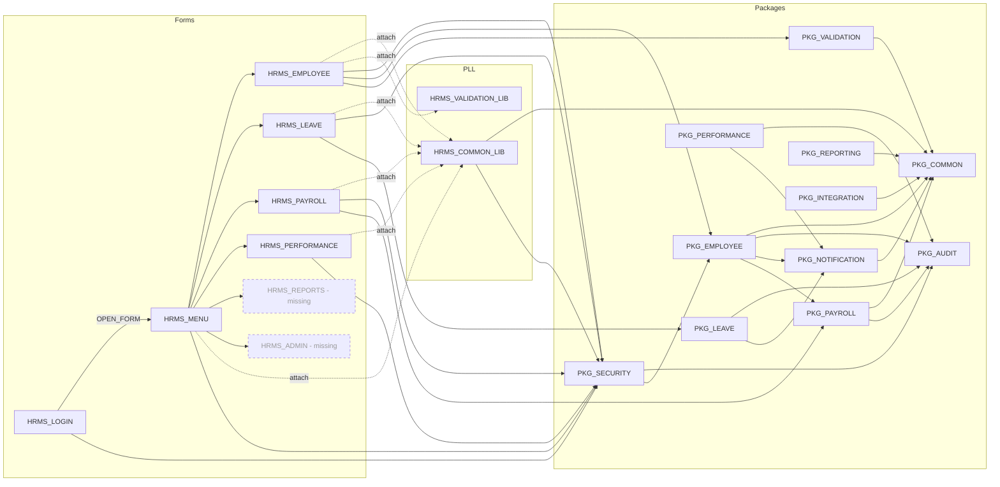
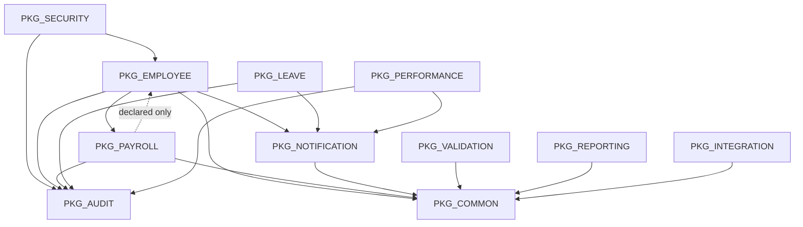
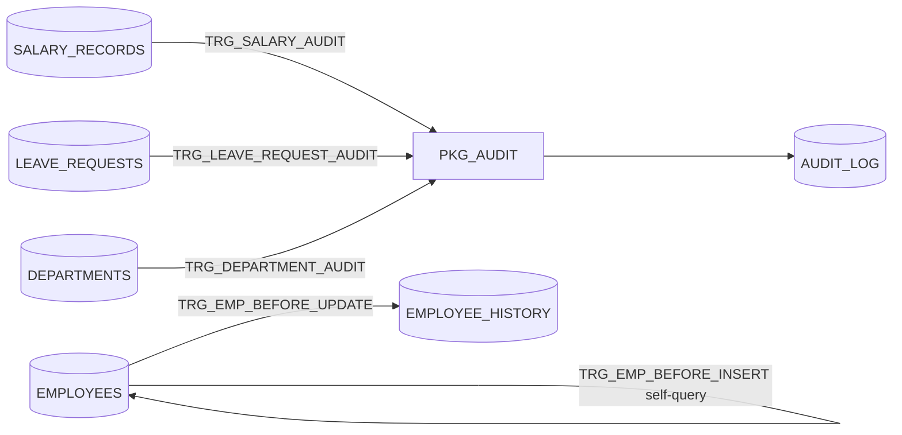

# HRMS Dependency Map

Multi-layer call graph of the checked-in estate: **Forms -> PLL libraries -> PL/SQL packages -> tables/views/sequences**, plus triggers, views and external runtime packages. Derived by static reading of every file under `forms/`, `plsql/` and `schema/` (no Oracle runtime / `ALL_DEPENDENCIES` was available). See [`APPLICATION_INVENTORY.md`](APPLICATION_INVENTORY.md) for the artifact list.

Edge evidence levels used throughout:

| Marker | Meaning |
|---|---|
| **V** (verified) | Executable call/reference found in a trigger body, package body or PLL unit |
| **D** (declared) | Stated only in a header comment / spec "Dependencies:" line, with no executable call |
| **M** (missing target) | Executable reference to an object not present in the repository |

## 1. Layered overview

Notable structural facts:

- `HRMS_PERFORMANCE` never calls `PKG_PERFORMANCE`; it does direct DML on `PERFORMANCE_REVIEWS`/`PERFORMANCE_GOALS`.
- `PKG_PERFORMANCE`, `PKG_REPORTING`, `PKG_INTEGRATION` have **no inbound caller** in the repo (only implied schedulers / missing `HRMS_REPORTS`).
- `HRMS_VALIDATION_LIB` is attached to `HRMS_EMPLOYEE` but **none of its units is called**; the form calls `PKG_VALIDATION.validate_email_format` instead.
- `PKG_VALIDATION` has a single caller (`HRMS_EMPLOYEE.xml:377`); no package uses it.

## 2. Layer 1 -> 2/3: Forms edges

| From form | To | Kind | Evidence |
|---|---|---|---|
| `HRMS_LOGIN` | `PKG_SECURITY.authenticate` | V call | `BTN_LOGIN` WHEN-BUTTON-PRESSED |
| `HRMS_LOGIN` | `EMPLOYEES` | V direct SELECT (`ROWNUM = 1` on email) | same trigger |
| `HRMS_LOGIN` | `HRMS_MENU` | V `OPEN_FORM` | same trigger |
| `HRMS_MENU` | `HRMS_COMMON_LIB` | V attach | `<AttachedLibrary>` |
| `HRMS_MENU` | `PKG_SECURITY.has_permission`, `PKG_SECURITY.logout` | V call | WNFI, `MI_LOGOUT` |
| `HRMS_MENU` | `HRMS_EMPLOYEE`, `HRMS_PAYROLL`, `HRMS_LEAVE`, `HRMS_PERFORMANCE` | V `OPEN_FORM` | button/menu items |
| `HRMS_MENU` | `HRMS_REPORTS`, `HRMS_ADMIN`, window `WIN_CHANGE_PWD` | **M** | `MI_REPORTS`, `MI_ADMIN`, `MI_CHANGE_PWD` |
| `HRMS_EMPLOYEE` | `HRMS_COMMON_LIB`, `HRMS_VALIDATION_LIB` | V attach | `<AttachedLibrary>` x2 |
| `HRMS_EMPLOYEE` | `PKG_SECURITY.is_session_valid`, `has_permission` | V call | WNFI |
| `HRMS_EMPLOYEE` | `PKG_EMPLOYEE.generate_emp_number`, `SEQ_EMPLOYEE` | V call | `EMPLOYEE` PRE-INSERT |
| `HRMS_EMPLOYEE` | `PKG_VALIDATION.validate_email_format` | V call | WHEN-VALIDATE-ITEM (L377) |
| `HRMS_EMPLOYEE` | `EMPLOYEES` (DML), `SALARY_RECORDS`, `DEPARTMENTS`, `JOB_TITLES`, `LOCATIONS` | V base table / record groups / POST-QUERY lookups | blocks, `RG_*` |
| `HRMS_EMPLOYEE` | blocks `DEPENDENT`, `EMERGENCY_CONTACT`, `EMP_HISTORY` | **M** | header and navigation comments |
| `HRMS_LEAVE` | `HRMS_COMMON_LIB` | V attach | |
| `HRMS_LEAVE` | `PKG_SECURITY.is_session_valid`, `PKG_LEAVE.submit_leave_request`, `PKG_LEAVE.cancel_leave_request` | V call | WNFI, `BTN_SUBMIT`, `BTN_CANCEL_REQ` |
| `HRMS_LEAVE` | `LEAVE_REQUESTS`, `LEAVE_BALANCES`, `LEAVE_TYPES` | V base table / record group / POST-QUERY | |
| `HRMS_PAYROLL` | `HRMS_COMMON_LIB` | V attach | |
| `HRMS_PAYROLL` | `PKG_SECURITY.*`, `PKG_PAYROLL.create_payroll_run`, `calculate_payroll`, `approve_payroll` | V call | 3 WBPs |
| `HRMS_PAYROLL` | `PAY_PERIODS`, `PAYROLL_RUNS` | V base table | |
| `HRMS_PERFORMANCE` | `HRMS_COMMON_LIB` | V attach | |
| `HRMS_PERFORMANCE` | `PKG_SECURITY.is_session_valid` | V call | WNFI |
| `HRMS_PERFORMANCE` | `REVIEW_CYCLES`, `PERFORMANCE_REVIEWS` (update), `PERFORMANCE_GOALS` (insert/update), `EMPLOYEES` (POST-QUERY) | V base table | bypasses `PKG_PERFORMANCE` |

## 3. Layer 2 -> 3: PLL edges

| Library unit | Calls | Kind |
|---|---|---|
| `HRMS_COMMON_LIB.handle_error` | `PKG_COMMON.log_error` | V |
| `HRMS_COMMON_LIB.check_session` | `PKG_SECURITY.is_session_valid` | V |
| `HRMS_COMMON_LIB.toolbar_*`, `refresh_lov` | Forms built-ins (`COMMIT_FORM`, `EXECUTE_QUERY`, `POPULATE_GROUP`...) | V |
| `HRMS_COMMON_LIB.get_current_user/get_session_id` | `:GLOBAL.current_user`, `:GLOBAL.session_id` | V (global state set by `HRMS_LOGIN`) |
| `HRMS_VALIDATION_LIB.validate_salary_range` | `JOB_GRADES` | V direct SELECT |
| `HRMS_VALIDATION_LIB` other units | none (pure PL/SQL) | - |

Note: `HRMS_COMMON_LIB` header states "Dependencies: None" - incorrect.

## 4. Layer 3: package-to-package graph

Verified edges come from grepping `PKG_[A-Z]+\.` in every `.pkb`, excluding comments and self-references.

| Caller (body) | Callee | Level | Example call site |
|---|---|---|---|
| `PKG_EMPLOYEE` | `PKG_COMMON` | V | `log_error` in exception handlers |
| `PKG_EMPLOYEE` | `PKG_AUDIT` | V | `log_action` in create/update/terminate |
| `PKG_EMPLOYEE` | `PKG_NOTIFICATION` | V | `send_notification` on hire/terminate |
| `PKG_EMPLOYEE` | `PKG_PAYROLL` | V | `create_salary_record` in `create_employee`/`promote_employee` |
| `PKG_SECURITY` | `PKG_AUDIT` | V | login/logout/password audit |
| `PKG_SECURITY` | `PKG_EMPLOYEE` | V (**undeclared**) | `set_session_context` in `authenticate` |
| `PKG_PAYROLL` | `PKG_COMMON`, `PKG_AUDIT` | V | |
| `PKG_LEAVE` | `PKG_AUDIT`, `PKG_NOTIFICATION` | V | |
| `PKG_PERFORMANCE` | `PKG_AUDIT`, `PKG_NOTIFICATION` | V | |
| `PKG_NOTIFICATION` | `PKG_COMMON` | V | `log_error` |
| `PKG_VALIDATION` | `PKG_COMMON` | V | |
| `PKG_REPORTING` | `PKG_COMMON` | V | |
| `PKG_INTEGRATION` | `PKG_COMMON` | V | |
| `PKG_PAYROLL` | `PKG_EMPLOYEE`, `PKG_NOTIFICATION` | D only | `PKG_PAYROLL.pks` header |
| `PKG_LEAVE`, `PKG_PERFORMANCE` | `PKG_EMPLOYEE`, `PKG_COMMON` | D only | spec headers |
| `PKG_REPORTING` | `PKG_EMPLOYEE`, `PKG_PAYROLL` | D only | spec header |
| `PKG_INTEGRATION` | `PKG_PAYROLL`, `PKG_EMPLOYEE` | D only | spec header |
| `PKG_EMPLOYEE` | `PKG_PAYROLL.calculate_final_pay`, `PKG_SECURITY` (revoke access) | **M** / TODO | `PKG_EMPLOYEE.pkb:737-739` - `calculate_final_pay` does not exist |

Fan-in (verified): `PKG_COMMON` 6 + PLL, `PKG_AUDIT` 6 + 3 triggers, `PKG_NOTIFICATION` 3, `PKG_EMPLOYEE` 1 + form, `PKG_PAYROLL` 1 + form. `PKG_COMMON` and `PKG_AUDIT` are leaf packages (no outbound package calls) - a healthy base layer.

## 5. Circular dependency analysis

| # | Cycle | Status | Detail / risk |
|---|---|---|---|
| C1 | `PKG_EMPLOYEE` <-> `PKG_PAYROLL` | **Declared, not realized in code.** | `PKG_EMPLOYEE` body calls `PKG_PAYROLL.create_salary_record` (V). `PKG_PAYROLL.pks` lists `PKG_EMPLOYEE` as a dependency and `PKG_EMPLOYEE.pkb:274` comments that payroll "may call `PKG_EMPLOYEE.is_active`", but no `PKG_EMPLOYEE.` reference exists in `PKG_PAYROLL.pkb`. README "known issues" also describes this cycle. Not a compile-time cycle today; it becomes one the moment the documented intent (payroll validating employee status, or `calculate_final_pay` on termination) is implemented. Spec-to-spec references only would still compile, but body-level mutual calls create invalidation cascades on every recompile and re-entrant transaction paths (salary insert -> audit -> employee). |
| C2 | `PKG_SECURITY` -> `PKG_EMPLOYEE` -> (`PKG_SECURITY` planned) | **Latent.** | `PKG_SECURITY.authenticate` calls `PKG_EMPLOYEE.set_session_context` (V, undeclared). `PKG_EMPLOYEE.pkb:738` TODO plans to call `PKG_SECURITY` to revoke access on termination -> would close a SECURITY <-> EMPLOYEE cycle. Also inverts layering (a shared security service depends on a domain package). |
| C3 | `PKG_REPORTING`/`PKG_INTEGRATION` -> `PKG_PAYROLL` -> ... | No cycle | Declared-only edges; bodies query payroll tables directly instead (bypassing the package API). |
| C4 | Trigger re-entrancy: `PKG_PAYROLL.create_salary_record` -> `SALARY_RECORDS` -> `TRG_SALARY_AUDIT` -> `PKG_AUDIT.log_action` (autonomous) | Not a cycle; double audit | `PKG_PAYROLL` and `PKG_EMPLOYEE` also call `PKG_AUDIT` explicitly, so salary changes are audited twice. |
| C5 | `EMPLOYEES` self-FK (`MANAGER_EMP_ID`) and `DEPARTMENTS.MANAGER_EMP_ID` <-> `EMPLOYEES.DEPT_ID` | Data-level cycle | Department head is an employee who belongs to a department. No FK on the department side, so no insert-order deadlock, but no integrity either. `PKG_EMPLOYEE.validate_manager` walks the chain to block manager loops; Forms `EMPLOYEE.MANAGER_EMP_ID` edits bypass it. |
| C6 | Forms: `HRMS_LOGIN` -> `HRMS_MENU` -> modules -> `KEY-EXIT` back to menu | UI navigation loop | Expected; uses `OPEN_FORM` (session-per-form), not a code dependency. |

Conclusion: **no compile-time circular dependency exists among package bodies**; one documented cycle (C1) and one latent cycle (C2) exist at design level and should be blocked by moving shared lookups (`is_active`, session context) into a lower-level service.

## 6. Layer 3 -> 4: package/table CRUD matrix

C = insert, R = select, U = update, D = delete.

| Table \ Package | EMP | PAY | LEAVE | PERF | SEC | COMMON | AUDIT | VALID | NOTIF | REPORT | INTEG | Forms / triggers |
|---|---|---|---|---|---|---|---|---|---|---|---|---|
| `EMPLOYEES` | CRU | R | R | R | R | | | R | R | R | R | EMPLOYEE CRU, LOGIN R, PERF/LEAVE R; trg BI/BU/BD |
| `EMPLOYEE_HISTORY` | C | | | | | | | | | | | trg BU C (wrong columns) |
| `EMPLOYEE_DEPENDENTS` | | | | | | | | | | | R | |
| `EMERGENCY_CONTACTS` | | | | | | | | | | | | (no code) |
| `DEPARTMENTS` | R | R | | R | | | | | | R | R | EMPLOYEE R; trg audit |
| `LOCATIONS` | | | | | | | | | | R | | EMPLOYEE R |
| `JOB_TITLES` | R | | | R | R | | | | | R | | EMPLOYEE R |
| `JOB_GRADES` | R | | | | | | | R | | R | | VALIDATION_LIB R |
| `SALARY_RECORDS` | R | CRU | | | | | | | | R | | EMPLOYEE R; trg audit |
| `PAY_ELEMENTS` | | R | | | | | | | | | R | |
| `EMPLOYEE_PAY_ELEMENTS` | U | R | | | | | | | | | | |
| `PAY_PERIODS` | | CRU | | | | | | | | | R | PAYROLL R |
| `PAYROLL_RUNS` | | CRU | | | | | | | | R | R | PAYROLL R |
| `PAYROLL_DETAILS` | | CRU | | | | | | | | R | R | |
| `TAX_BRACKETS` | | | | | | | | | | | | **unused** |
| `EMPLOYEE_TAX_INFO` | | R | | | | | | | | | | |
| `EMPLOYEE_BANK_ACCOUNTS` | | | | | | | | | | | | **unused** |
| `LEAVE_TYPES` | | | R | | | | | | | R | | LEAVE R |
| `LEAVE_BALANCES` | | | CRU | | | | | | | R | | LEAVE R |
| `LEAVE_REQUESTS` | U | | CRU | | | | | | | | | LEAVE R; trg audit |
| `LEAVE_ACCRUAL_LOG` | | | C | | | | | | | | | |
| `HOLIDAYS` | | | R | | | | | R | | | | |
| `REVIEW_CYCLES` | | | | CRU | | | | | | | | PERF R |
| `PERFORMANCE_REVIEWS` | | | | CRU | | | | | | | | PERF RU |
| `PERFORMANCE_GOALS` | | | | CRU | | | | | | | | PERF CRU |
| `AUDIT_LOG` | | | | | | C | CRD | | | | | 3 audit triggers via PKG_AUDIT |
| `SYSTEM_PARAMETERS` | | | | | | RU | | | | | R (via `PKG_COMMON.get_param`) | |
| `NOTIFICATION_QUEUE` | | | | | | | | | CRU | | | |
| `USER_SESSIONS` | | | | | CRU | | | | | | | |
| `LOOKUP_VALUES` | | | | | | | | | | | | **unused** |

Sequences: each package uses the `SEQ_*` matching the table it inserts (e.g. `SEQ_PAYROLL_DETAIL`, `SEQ_LEAVE_REQUEST`, `SEQ_NOTIFICATION`, `SEQ_AUDIT`); `HRMS_EMPLOYEE` uses `SEQ_EMPLOYEE`. `SEQ_EMP_NUMBER`, `SEQ_TAX_BRACKET`, `SEQ_LOOKUP`, `SEQ_DEPENDENT`, `SEQ_EMERGENCY_CONTACT` are never referenced.

## 7. Triggers and views

| View | Depends on | Consumers in repo |
|---|---|---|
| `VW_ACTIVE_EMPLOYEES` | EMPLOYEES (x2), DEPARTMENTS, JOB_TITLES, JOB_GRADES, LOCATIONS, SALARY_RECORDS | none |
| `VW_ORG_HIERARCHY` | EMPLOYEES | none (`PKG_EMPLOYEE.get_org_chart` re-implements the `CONNECT BY`) |
| `VW_EMPLOYEE_COMPENSATION` | EMPLOYEES, JOB_TITLES, JOB_GRADES, SALARY_RECORDS, DEPARTMENTS | none (`PKG_REPORTING.compensation_summary` re-implements) |
| `VW_LEAVE_SUMMARY` | LEAVE_BALANCES, LEAVE_TYPES, EMPLOYEES | none |
| `VW_PAYROLL_LATEST` | PAYROLL_DETAILS, PAYROLL_RUNS, PAY_PERIODS, EMPLOYEES | none |
| `VW_PENDING_APPROVALS` | LEAVE_REQUESTS, PERFORMANCE_REVIEWS, EMPLOYEES, LEAVE_TYPES | none (`PKG_LEAVE.get_pending_requests` re-implements leave half) |

## 8. External and batch dependencies

| Component | External dependency | Direction | Notes |
|---|---|---|---|
| `PKG_SECURITY` | `DBMS_CRYPTO` | call | MD5 / AES |
| `PKG_NOTIFICATION.process_queue` | `UTL_SMTP` -> `smtp.internal.company.com:25` | outbound | Hard-coded; ignores `SYSTEM_PARAMETERS.SMTP_HOST` |
| `PKG_PAYROLL.generate_pay_register` | `UTL_FILE` dir `PAYROLL_OUTPUT` | outbound CSV | |
| `PKG_INTEGRATION.generate_gl_journal` | `UTL_FILE` `GL_FEED_OUT` -> Oracle EBS GL | outbound | |
| `PKG_INTEGRATION.export_benefits_feed` | `UTL_FILE` `BENEFITS_FEED_OUT` -> ADP | outbound | PII |
| `PKG_INTEGRATION.import_time_attendance` | `UTL_FILE` `TIME_ATTENDANCE_IN` (Kronos) | inbound | stub |
| `PKG_INTEGRATION.sync_org_structure` | Active Directory | outbound | stub |
| Scheduler (documented only) | `DBMS_SCHEDULER` | inbound | `PKG_PAYROLL.calculate_payroll`, `PKG_LEAVE.run_monthly_accrual`/`process_carryover`, `PKG_NOTIFICATION.process_queue`/`retry_failed`, `PKG_AUDIT.purge_old_records`, integration feeds. No job DDL in repo. |
| All forms | WebLogic Forms Services, `:GLOBAL` variables | runtime | |

## 9. Key call chains (end-to-end)

1. **Login:** `HRMS_LOGIN` -> `PKG_SECURITY.authenticate` -> (`EMPLOYEES` R, `USER_SESSIONS` C, `PKG_EMPLOYEE.set_session_context`, `PKG_AUDIT.log_action` -> `AUDIT_LOG`) -> `:GLOBAL.session_id` -> `OPEN_FORM(HRMS_MENU)`.
2. **Hire (form path):** `HRMS_EMPLOYEE` PRE-INSERT -> `SEQ_EMPLOYEE`, `PKG_EMPLOYEE.generate_emp_number` -> INSERT `EMPLOYEES` -> `TRG_EMP_BEFORE_INSERT`. Bypasses `PKG_EMPLOYEE.create_employee` (no salary record, history, audit or notification).
3. **Hire (package path, no UI caller):** `PKG_EMPLOYEE.create_employee` -> `EMPLOYEES` C -> `PKG_PAYROLL.create_salary_record` -> `SALARY_RECORDS` C -> `TRG_SALARY_AUDIT` -> `PKG_AUDIT`; + `EMPLOYEE_HISTORY` C, `PKG_NOTIFICATION.send_notification` -> `NOTIFICATION_QUEUE`.
4. **Leave:** `HRMS_LEAVE` -> `PKG_LEAVE.submit_leave_request` -> `LEAVE_TYPES`/`LEAVE_BALANCES`/`HOLIDAYS` R -> `LEAVE_REQUESTS` C -> `LEAVE_BALANCES` U (`PENDING`) -> `PKG_NOTIFICATION` -> (auto-approve) `approve_leave_request` -> `TRG_LEAVE_REQUEST_AUDIT`.
5. **Payroll:** `HRMS_PAYROLL` -> `PKG_PAYROLL.create_payroll_run` -> `calculate_payroll` -> loop `calculate_employee_pay` (`SALARY_RECORDS`, `EMPLOYEE_TAX_INFO`, `EMPLOYEE_PAY_ELEMENTS` R -> `PAYROLL_DETAILS` C) -> `PAYROLL_RUNS` U -> `approve_payroll` -> `PKG_AUDIT`. Downstream (scheduled): `PKG_INTEGRATION.generate_gl_journal`, `PKG_PAYROLL.generate_pay_register`.
6. **Performance (form path):** `HRMS_PERFORMANCE` -> direct UPDATE `PERFORMANCE_REVIEWS` / INSERT `PERFORMANCE_GOALS`. No package, audit, or notification involvement.
