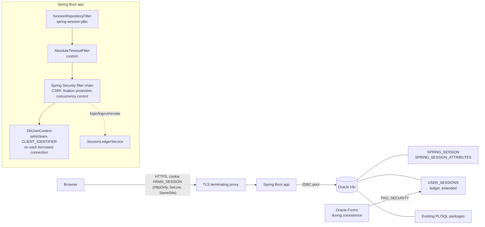

# Session Management Migration Design (Step 3)

> **Status:** Draft for review. **Scope:** design only - no code or DDL in this repository is changed.
> **Target stack:** Java 17+, Spring Boot 3.x, Spring Security 6.x, Spring Session JDBC on the existing Oracle Database 19c.
> **Related reports:** [`TECHNICAL_DEBT_REPORT.md`](TECHNICAL_DEBT_REPORT.md) (SEC-01, SEC-06, SEC-09, SEC-14, DRIFT-12), [`DATA_DICTIONARY.md`](DATA_DICTIONARY.md) (`USER_SESSIONS`), [`DEPENDENCY_MAP.md`](DEPENDENCY_MAP.md) (`PKG_SECURITY` → `PKG_EMPLOYEE`).

## 1. Context and goals

The PKG_SECURITY remediation plan has four steps: (1) rotate the encryption key, (2) SSO + MFA, (3) session management, (4) server-side RBAC. This document covers **step 3, delivered first**.

Session management is independent of *how* a user authenticates, so it can ship before SSO. The Spring Security `AuthenticationProvider` is swapped later without touching the session layer. **Caveat:** until SEC-01 (authentication never verifies the password) is fixed, a hardened session still protects an unauthenticated login. This step removes session-level weaknesses (predictable IDs, no idle timeout, broken validation in four forms, no revocation); it does not by itself close the login bypass.

**Goals**

| # | Goal | Addresses |
|---|---|---|
| G1 | Unguessable, high-entropy session identifiers, never exposed to scripts or logs | SEC-14, predictable `SEQ_USER_SESSION` IDs |
| G2 | Idle (sliding) timeout **and** absolute lifetime, driven by `SYSTEM_PARAMETERS` | SEC-14, DRIFT-12 |
| G3 | Side-effect-free validation on every request, enforced server-side | SEC-09, SEC-14 (DML in `is_session_valid`) |
| G4 | Logout and admin/offboarding revocation (all sessions of a user, across channels) | SEC-14 (logout without ownership check), DRIFT-10 offboarding gap |
| G5 | Correct user attribution in `AUDIT_LOG` and PL/SQL called from a pooled Java connection | RACE-08, `PKG_EMPLOYEE` package globals |
| G6 | Coexistence with Oracle Forms during the strangler migration, then clean retirement | - |

**Non-goals:** credential verification, password storage, MFA (step 2); permission model (step 4); migrating Forms screens themselves.

## 2. Current state (as-is)

### 2.1 Components

| Element | Source | Behaviour |
|---|---|---|
| Session table | `schema/tables/04_performance_tables.sql:153-165` | `USER_SESSIONS(SESSION_ID NUMBER(15) PK, EMP_ID FK, USERNAME, LOGIN_TIME, LOGOUT_TIME, IP_ADDRESS, FORMS_MODULE, SESSION_STATUS DEFAULT 'ACTIVE', CREATED_DATE)`. No CHECK on `SESSION_STATUS`, no last-activity column, no index besides PK. |
| ID generator | `schema/sequences/hrms_sequences.sql:47` | `SEQ_USER_SESSION START WITH 1 INCREMENT BY 1 NOCACHE` - the session id **is** the sequence value. |
| Create | `plsql/packages/PKG_SECURITY.pkb:30-80` (`authenticate`, insert at L64-72) | Inserts `ACTIVE` row with client-supplied `p_ip_address`; `FORMS_MODULE` never populated; calls `PKG_EMPLOYEE.set_session_context` (L75); returns the numeric id. |
| Validate | `PKG_SECURITY.pkb:98-127` (`is_session_valid`) | Reads status + `LOGIN_TIME`; if `now - LOGIN_TIME > c_session_timeout_min` (constant **30**, L8) it **UPDATEs** the row to `EXPIRED` (DML inside a function, no commit). Absolute timeout from login only - an active user is logged out at minute 31; an idle user is valid for 30 minutes. Ignores `SYSTEM_PARAMETERS.SESSION_TIMEOUT_MIN` (seed `data/seed/01_reference_data.sql:191`). |
| Logout | `PKG_SECURITY.pkb:85-93` | `UPDATE ... SESSION_STATUS='CLOSED'` by id only - any caller can close any session; no commit inside (relies on the Forms transaction). |
| Client storage | `HRMS_LOGIN.xml:82-83`, `HRMS_COMMON_LIB.pll.sql:119-138` | Id held in `:GLOBAL.session_id` (and shown in the MDI window title, `HRMS_MENU.xml:21-23`). `HRMS_COMMON_LIB.check_session` validates it correctly but **is never called**. |
| Per-form validation | `HRMS_EMPLOYEE.xml:34`, `HRMS_PAYROLL.xml:27`, `HRMS_LEAVE.xml:25-26`, `HRMS_PERFORMANCE.xml:23-24` | Pass `TO_NUMBER(GET_APPLICATION_PROPERTY(USERNAME))` - the **DB account name**, not the session id (SEC-09). |
| User context | `PKG_EMPLOYEE.pks:14-16`, `PKG_EMPLOYEE.pkb:948-963` | Package globals `g_current_user`, `g_current_emp_id`, `g_current_dept_id` set at login. Per DB session state. |
| Audit link | `PKG_AUDIT.pkb:16-25` | `AUDIT_LOG.SESSION_ID := SYS_CONTEXT('USERENV','SESSIONID')` - the **Oracle** session, not the HRMS session; audit rows cannot be joined to `USER_SESSIONS`. |
| Exception | `PKG_SECURITY.pks:17,21` | `e_session_expired (-20303)` declared but never raised. |

### 2.2 Defects carried into requirements

1. Sequential IDs are trivially guessable (`id+1` is the next user's session).
2. No idle timeout; absolute timeout value hard-coded (and too short for real work at the same time).
3. Validation in four forms uses the wrong value (SEC-09) - *Inferred:* either `ORA-01722` on open or validation against a meaningless id.
4. Validation mutates state; expiry is lost if the Forms transaction rolls back.
5. No ownership check on logout; no bulk revocation; `terminate_employee` does not end sessions (TODO at `PKG_EMPLOYEE.pkb:737-739`).
6. Client-reported IP (`GET_APPLICATION_PROPERTY(CLIENT_HOST)`) is stored as fact.
7. Package-global user context would leak between users if reused on pooled connections (critical once Java calls existing PL/SQL).
8. No retention/purge of `USER_SESSIONS`.

## 3. Target architecture



### 3.1 Key decisions

| ID | Decision | Rationale | Alternatives rejected |
|---|---|---|---|
| D1 | **Spring Session JDBC** (`JdbcIndexedSessionRepository`) on the existing Oracle DB | ~200 concurrent users (README) is a trivial load; no new infrastructure to run, back up or secure; sessions survive app restarts and work across multiple app nodes. | Redis (extra infra, ops skills); container-local `HttpSession` (lost on restart, sticky sessions needed). |
| D2 | Session id generated by Spring Session (random UUID by default) and transported **only** in an `HttpOnly`/`Secure` cookie | Removes guessability; script-inaccessible; never placed in URLs, window titles or logs. | Bearer tokens/JWT in browser storage (XSS-exposed, no server-side revocation without a deny-list). |
| D3 | **Keep `USER_SESSIONS` as a business/audit ledger**, separate from the technical `SPRING_SESSION` store | Spring Session rows are deleted on expiry; HR/compliance need history (who logged in, when, from where, how it ended). Ledger never stores the raw session id - only a SHA-256 hash. | Using `SPRING_SESSION` as history (rows disappear); dropping session history (audit regression). |
| D4 | Idle timeout = Spring Session `maxInactiveInterval`; absolute lifetime = custom filter on `Session.getCreationTime()` | Spring Session implements sliding expiry natively; absolute lifetime is not built in, so a ~30-line `OncePerRequestFilter` invalidates sessions older than the configured maximum. | Absolute-only (current defect); idle-only (stolen cookie can be kept alive indefinitely). |
| D5 | Timeouts sourced from `SYSTEM_PARAMETERS` at startup (with refresh on admin change), not constants | Single source of truth shared with Forms during coexistence (DRIFT-12). | `application.yml` constants (re-creates drift). |
| D6 | Per-request DB user context via `DBMS_SESSION.SET_IDENTIFIER` (and `DBMS_APPLICATION_INFO`) set on connection borrow and **cleared on return** | Pooled connections are shared between users; `PKG_EMPLOYEE` package globals would otherwise attribute user A's actions to user B. `CLIENT_IDENTIFIER` is visible to `SYS_CONTEXT('USERENV','CLIENT_IDENTIFIER')` for `PKG_AUDIT`. | Calling `PKG_EMPLOYEE.set_session_context` per request without clearing (leaks state); one DB connection per user (does not scale, defeats pooling). |
| D7 | Forms and Java keep **separate session stores** during coexistence, but **share the ledger and revocation** | Forms sessions cannot be validated by Spring (and vice versa) without a bespoke bridge; separate stores keep both simple, while one ledger gives one view of "who is logged in" and one revoke action. | Shared SSO-style token between Forms and Java (complex, temporary, discarded at Forms retirement). |
| D8 | No migration of live sessions at cutover | Sessions are short-lived (minutes/hours); users re-authenticate once. | Translating `USER_SESSIONS` rows into Spring sessions (re-imports predictable IDs). |

## 4. Data model

### 4.1 Spring Session store (new)

Created from the Oracle script shipped inside `spring-session-jdbc` (`org/springframework/session/jdbc/schema-oracle.sql`), deployed through the normal DDL release, **not** by `spring.session.jdbc.initialize-schema` at runtime. Tables: `SPRING_SESSION` (primary id, session id, creation/last-access/expiry times, max inactive interval, principal name) and `SPRING_SESSION_ATTRIBUTES` (serialized attributes). Use the script from the exact library version adopted; do not hand-copy column definitions from this document.

Placement: same `HRMS` schema or a dedicated `HRMS_APP` schema owned separately, with the application DB user granted only `SELECT/INSERT/UPDATE/DELETE` on these two tables (recommended: dedicated schema).

Session attributes kept minimal and non-sensitive: `SecurityContext` (principal = employee identifier), `EMP_ID`, `HRMS_LEDGER_ID`. No SSNs, salaries or permission caches beyond what Spring Security stores.

### 4.2 `USER_SESSIONS` ledger (extended, backward compatible)

Proposed DDL (illustrative; delivered as a forward-only migration in the step-3 implementation, not in this PR):

```sql
ALTER TABLE HRMS.USER_SESSIONS ADD (
    CHANNEL             VARCHAR2(10)   DEFAULT 'FORMS' NOT NULL,  -- FORMS | WEB
    SESSION_KEY_HASH    VARCHAR2(64),                             -- SHA-256 hex of Spring session id; NULL for FORMS
    LAST_ACTIVITY_TIME  DATE,
    END_REASON          VARCHAR2(20),                             -- LOGOUT | IDLE_TIMEOUT | ABSOLUTE_TIMEOUT | REVOKED | SUPERSEDED
    ENDED_BY            VARCHAR2(30),                             -- user/admin who revoked, when applicable
    USER_AGENT          VARCHAR2(400)
);

ALTER TABLE HRMS.USER_SESSIONS ADD CONSTRAINT CHK_US_STATUS
    CHECK (SESSION_STATUS IN ('ACTIVE', 'CLOSED', 'EXPIRED', 'REVOKED'));
ALTER TABLE HRMS.USER_SESSIONS ADD CONSTRAINT CHK_US_CHANNEL
    CHECK (CHANNEL IN ('FORMS', 'WEB'));

CREATE UNIQUE INDEX HRMS.UX_US_KEY_HASH ON HRMS.USER_SESSIONS (SESSION_KEY_HASH);
CREATE INDEX HRMS.IX_US_EMP_STATUS ON HRMS.USER_SESSIONS (EMP_ID, SESSION_STATUS);
```

Notes:
- `SESSION_ID` stays as the ledger surrogate key from `SEQ_USER_SESSION`; once it is no longer a credential its predictability is harmless.
- Existing rows default to `CHANNEL = 'FORMS'`; existing `PKG_SECURITY` inserts continue to work unchanged.
- Before adding `CHK_US_STATUS`, verify existing data contains only the listed statuses (`SELECT DISTINCT SESSION_STATUS`).
- `IP_ADDRESS` for `WEB` rows comes from the request as resolved by `ForwardedHeaderFilter` behind the trusted proxy only.

### 4.3 New `SYSTEM_PARAMETERS` rows

| Category | Name | Proposed value | Meaning |
|---|---|---|---|
| SECURITY | `SESSION_TIMEOUT_MIN` (existing, id 5) | `30` | Idle timeout (sliding). Re-interpreted from "absolute" to "idle" for both channels. |
| SECURITY | `SESSION_ABSOLUTE_MAX_MIN` | `600` | Hard lifetime (10 h covers a working day across regional offices). |
| SECURITY | `SESSION_MAX_CONCURRENT` | `3` | Max simultaneous `WEB` sessions per user; oldest is expired (`SUPERSEDED`). |
| SECURITY | `SESSION_LEDGER_RETENTION_DAYS` | `180` | Purge horizon for closed ledger rows (~6 months). Set per requester decision (§9/Q3). |

All values on this page are approved by the requester (§9); the retention period is 180 days at their instruction.

## 5. Session lifecycle (WEB channel)

| Event | Mechanism | Ledger effect |
|---|---|---|
| **Login success** | `AuthenticationSuccessHandler`; Spring Security changes the session id on authentication (session-fixation protection, default `changeSessionId`). Concurrency control via `SpringSessionBackedSessionRegistry` + `maximumSessions(SESSION_MAX_CONCURRENT)`. | Insert `ACTIVE`, `CHANNEL='WEB'`, `SESSION_KEY_HASH`, IP, user agent. Store ledger id in session attribute. |
| **Each request** | `SessionRepositoryFilter` loads the session, enforces idle expiry, updates last access. `AbsoluteTimeoutFilter` invalidates if `now - creationTime > SESSION_ABSOLUTE_MAX_MIN`. `DbUserContext` sets `CLIENT_IDENTIFIER` on the borrowed connection and clears it in `finally`. Validation is read-only from the application's point of view (G3). | `LAST_ACTIVITY_TIME` updated **at most once per minute** per session (throttled) to avoid a ledger write per request. |
| **Logout** | `POST /logout` with CSRF token; `LogoutHandler` invalidates the session, clears cookie (`Clear-Site-Data: "cookies"` optional). Only the owner's own session can be ended this way (fixes SEC-14 ownership issue). | `CLOSED`, `END_REASON='LOGOUT'`. |
| **Idle / absolute expiry** | Spring Session deletes expired rows on its cleanup schedule (`spring.session.jdbc.cleanup-cron`, default every minute). `JdbcIndexedSessionRepository` does not publish expiry events (confirm for the adopted version), so a **reconciliation job** (every 5 min) marks ledger rows `EXPIRED` whose `SESSION_KEY_HASH` no longer exists in `SPRING_SESSION`, setting `END_REASON` from `LAST_ACTIVITY_TIME` vs creation time. | `EXPIRED`, `IDLE_TIMEOUT` / `ABSOLUTE_TIMEOUT`. |
| **Revocation (admin / offboarding)** | `SessionRevocationService.revokeAll(empId, actor)`: `FindByIndexNameSessionRepository.findByPrincipalName()` → `deleteById()` for each WEB session **and** `UPDATE USER_SESSIONS SET SESSION_STATUS='REVOKED' ... WHERE EMP_ID=:id AND CHANNEL='FORMS' AND SESSION_STATUS='ACTIVE'` for Forms sessions. Called by the termination workflow and an admin endpoint protected by step-4 permissions (interim: restricted role). | `REVOKED`, `ENDED_BY`. |
| **Concurrency overflow** | Oldest session expired by Spring Security registry. | `EXPIRED`, `SUPERSEDED`. |
| **Purge** | Nightly job deletes ledger rows ended more than `SESSION_LEDGER_RETENTION_DAYS` ago, in batches. | - |

### 5.1 Cookie and transport settings

| Setting | Value |
|---|---|
| Cookie name | `HRMS_SESSION` (not `SESSION`/`JSESSIONID`, to avoid collisions with WebLogic apps on the same host) |
| Flags | `HttpOnly`, `Secure`, `SameSite=Lax` (`Strict` if no cross-site entry points such as e-mail deep links are needed) |
| Scope | `Path=/`, host-only (no `Domain` attribute) |
| Persistence | Session cookie (no `Max-Age`); **no remember-me** |
| Transport | TLS only; HSTS at the proxy; HTTP redirected |
| CSRF | Spring Security CSRF enabled for all state-changing requests (session-based auth requires it) |
| Logging | Session id never logged; correlation via ledger `SESSION_ID` or a request id |

### 5.2 Long-running operations

Payroll calculation currently runs synchronously in the Forms session (PERF-09). In the WEB channel the request must not hold a session/connection for the whole run: submit an asynchronous job, return a job id, and poll. Session expiry during a run must not cancel the job; the job runs under a service identity and records the submitting `EMP_ID` for audit.

## 6. Coexistence with Oracle Forms

During migration both channels run against the same database.

### 6.1 Interim Forms hardening (Phase 0, PL/SQL only)

Small, low-risk changes that make the Forms channel consistent with the target policy and the shared ledger:

1. Replace the four `TO_NUMBER(GET_APPLICATION_PROPERTY(USERNAME))` validations with `HRMS_COMMON_LIB.check_session` (fixes SEC-09).
2. `is_session_valid`: read `SESSION_TIMEOUT_MIN` / `SESSION_ABSOLUTE_MAX_MIN` from `SYSTEM_PARAMETERS`; check idle time against `LAST_ACTIVITY_TIME`; make it **pure** (no DML). Add `touch_session(p_session_id)` and `expire_session(p_session_id, p_reason)` procedures using an autonomous transaction for the ledger write only.
3. `logout`: require the caller's `EMP_ID` to match the row; set `END_REASON='LOGOUT'`.
4. Add `revoke_user_sessions(p_emp_id, p_actor)`; call it from `PKG_EMPLOYEE.terminate_employee` (closes the TODO at L737-739 without creating a body-level cycle if placed in a small `PKG_SESSION` package that `PKG_EMPLOYEE` calls and that calls no domain package).
5. Stop displaying the session id in the MDI window title (`HRMS_MENU.xml:21-23`).

Forms session ids remain sequence-based (Forms has no secure cookie channel); this residual risk ends at Forms retirement and is mitigated by idle timeout and revocation.

### 6.2 Identity mapping

| Item | Now (pre-SSO) | After step 2 (SSO) |
|---|---|---|
| Spring principal name | Employee `EMAIL` (what `PKG_SECURITY.authenticate` accepts as username) | IdP subject; mapped to `EMP_ID` via an `EMPLOYEE_IDENTITIES` mapping table |
| `EMP_ID` | Resolved once at login, stored as session attribute | Same |
| DB attribution | `CLIENT_IDENTIFIER = EMAIL` (≤ 64 chars) | `CLIENT_IDENTIFIER = EMP_ID` or stable login name |

`PKG_AUDIT.log_action` should prefer `SYS_CONTEXT('USERENV','CLIENT_IDENTIFIER')` over `p_user DEFAULT USER` when called from the WEB channel, and record the HRMS ledger `SESSION_ID` (via `DBMS_APPLICATION_INFO.SET_CLIENT_INFO` or an application context) instead of the Oracle `SESSIONID`, so audit rows join to `USER_SESSIONS`.

### 6.3 Pooled-connection safety (critical)

Any Java call into existing PL/SQL that reads `PKG_EMPLOYEE.g_current_*` must run inside `DbUserContext`, which on borrow calls `PKG_EMPLOYEE.set_session_context(:user, :emp_id)` and `DBMS_SESSION.SET_IDENTIFIER`, and on return calls `DBMS_SESSION.CLEAR_IDENTIFIER` and resets the globals (or `DBMS_SESSION.RESET_PACKAGE` for the affected packages). A connection-pool `connectionInitSql`-style hook is not sufficient because it runs once per physical connection, not per borrow. Integration tests must prove that two interleaved users on a pool of size 1 never see each other's context.

## 7. Cutover plan

| Phase | Content | Exit criteria | Rollback |
|---|---|---|---|
| **0. Prepare** | Business sign-off on §4.3 values. Phase-0 Forms hardening (§6.1) released. `USER_SESSIONS` DDL (§4.2) and `SPRING_SESSION*` tables deployed. New parameters seeded. | Forms regression pass: login, open each module, idle expiry, logout, revoke on termination. No `ORA-01722` on module open. | Revert PL/SQL package versions; new columns/tables are additive and can remain. |
| **1. Shadow** | Spring Boot app deployed with session layer, ledger, reconciliation and purge jobs; only a health page and "who am I" page; access limited to the project team. | Test suite in §8 green in the target environment; reconciliation lag < 5 min; no session ids in logs. | Disable app route at proxy. |
| **2. Pilot** | First migrated screens (read-only recommended, e.g. leave balance view) for one regional office. Forms remains primary. | Two weeks without session-related incidents; idle/absolute timeouts observed as configured; revocation verified end-to-end in both channels. | Route pilot users back to Forms; WEB sessions revoked by `revokeAll`. |
| **3. Expand** | Further screens and offices as they are migrated. Concurrency limit enforced. | Per-screen acceptance; ledger shows both channels coherently. | Per-screen feature flag. |
| **4. Retire Forms sessions** | When the last Forms module is gone: mark remaining `CHANNEL='FORMS' AND SESSION_STATUS='ACTIVE'` rows `EXPIRED`/`SUPERSEDED`; remove `authenticate`/`is_session_valid`/`logout` from `PKG_SECURITY` (or leave as raising `e_session_expired`); keep `USER_SESSIONS` as history; keep `SEQ_USER_SESSION` for ledger ids. | No Forms logins for 30 days; no callers of removed procedures (`DBA_DEPENDENCIES` check). | Restore package versions (Forms binaries archived). |

Operational notes: cut over outside business hours of all three regional offices; users must log in again at each channel switch (D8); communicate the new idle-timeout behaviour (users are no longer logged out after 30 minutes of *activity*).

## 8. Verification and acceptance criteria

| # | Test | Expected |
|---|---|---|
| T1 | Inspect `Set-Cookie` after login | `HRMS_SESSION`, `HttpOnly; Secure; SameSite=Lax; Path=/`, no `Domain`, no `Max-Age` |
| T2 | Session id before vs after login | Different (fixation protection) |
| T3 | Idle for `SESSION_TIMEOUT_MIN` + 1 min, then request | 401/redirect to login; ledger `EXPIRED/IDLE_TIMEOUT` within reconciliation interval |
| T4 | Continuous activity beyond `SESSION_ABSOLUTE_MAX_MIN` | Forced re-login; ledger `ABSOLUTE_TIMEOUT` |
| T5 | Change `SESSION_TIMEOUT_MIN` in `SYSTEM_PARAMETERS` | New value applies to new sessions after refresh in both channels |
| T6 | Logout, replay old cookie | Rejected |
| T7 | Admin revoke / employee termination | All WEB and FORMS sessions of the user end within one request/validation cycle; ledger `REVOKED` with `ENDED_BY` |
| T8 | 4th concurrent login with limit 3 | Oldest session invalidated; ledger `SUPERSEDED` |
| T9 | POST without CSRF token | 403 |
| T10 | Two users interleaved on a pool of size 1 calling PL/SQL that reads `PKG_EMPLOYEE.g_current_user` and `PKG_AUDIT.log_action` | Each sees only their own identity; `AUDIT_LOG.CHANGED_BY` correct |
| T11 | App node restart / second node | Sessions survive and are valid on either node |
| T12 | Log scan (app, proxy, DB audit) | No raw session ids |
| T13 | Load: 250 concurrent sessions, 1 req/s each | p95 session overhead < 10 ms; no lock waits on `SPRING_SESSION` |
| T14 | Forms (Phase 0): open every module after login | No `ORA-01722`; idle timeout enforced; window title has no session id |

## 9. Risks and open questions

| # | Item | Owner / decision needed |
|---|---|---|
| Q1 | ~~Approve timeout values~~ **Approved:** idle 30 min, absolute 10 h, 3 concurrent sessions. | Approved |
| Q2 | Dedicated `HRMS_APP` schema for `SPRING_SESSION*` vs `HRMS`. Default (dedicated `HRMS_APP`) accepted by requester; DBA creates it at implementation time. | DBA (proceed) |
| Q3 | Ledger retention **approved at 180 days (~6 months)** by requester (raised from 24 h after review). | Approved |
| Q4 | Confirm `JdbcIndexedSessionRepository` event behaviour and `schema-oracle.sql` for the chosen Spring Session version (reconciliation job assumes no expiry events). | Engineering |
| R1 | **Login bypass (SEC-01) remains** until step 2; hardened sessions do not prevent impersonation at login. Consider an interim password check against a real credential store if step 2 is far away. | Security |
| R2 | Pooled-connection context leakage if any code path bypasses `DbUserContext`. Mitigate with T10, an ArchUnit rule forbidding direct `DataSource` use, and clearing context on return. | Engineering |
| R3 | Forms channel keeps sequential ids until retirement. Mitigated by idle timeout, revocation and not displaying ids. | Accepted residual risk |
| R4 | Users experience a behaviour change (idle vs absolute timeout); helpdesk briefing needed. | Change management |

## 10. Traceability

| Finding | How this design addresses it |
|---|---|
| SEC-09 (session id from DB username) | Phase 0 item 1; WEB channel uses cookie-bound sessions (D2). |
| SEC-14 (absolute timeout, logout ownership) | D4, D5, §5 logout, Phase 0 items 2-3. |
| SEC-01 (no password check) | **Not addressed** - see R1; step 2. |
| SEC-06 / SEC-10 (UI-only, grade-based authorization) | Not addressed - step 4. Revocation endpoint guarded by an interim role. |
| DRIFT-10 (offboarding gap) | Revocation on termination (§5, Phase 0 item 4). |
| DRIFT-12 (config in code) | D5, §4.3. |
| RACE-08 (autonomous transactions) / audit linkage | Ledger writes are the only autonomous writes added; audit linked to ledger session (§6.2). |
| PERF-09 (synchronous payroll) | §5.2 async jobs in WEB channel. |
